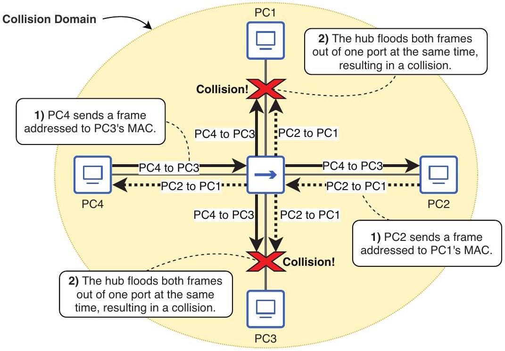
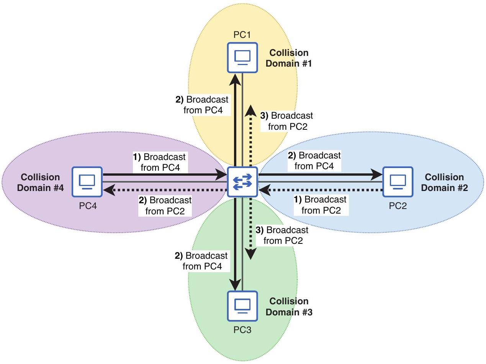

# Collision Domain

tags: #concept #acting-ccna #ethernet #layer2

## Definition

Collision Domain 是一組可能彼此發生 Ethernet collision 的設備範圍。

## Why It Exists

在 hub 或 shared medium 中，多台設備共用傳輸媒介，若同時傳送就可能 collision；理解 collision domain 有助於分辨 hub 與 switch 的行為差異。

## Related Concepts

- [[Duplex]]
- [[CSMA-CD]]
- [[Switch]]
- [[Ethernet]]

## Mechanism

Hub 連接的所有 hosts 屬於同一 collision domain；switch 讓每個連接的 host 擁有自己的 collision domain，因此不同 switch ports 上的 hosts 可同時傳送。

## Source Figures

*Source: [[00_Source/Chapter 8 - Router 與 Switch 介面]], Figure 8.2 — Four PCs connected to a hub are in the same collision domain.*

*Source: [[00_Source/Chapter 8 - Router 與 Switch 介面]], Figure 8.3 — Four PCs connected to a switch, each in its own collision domain.*

## Appears In

- [[02_Source_Notes/Unit4-RouterSwitch-Packet|Unit04：Router / Switch 介面、路由與封包生命週期]]
