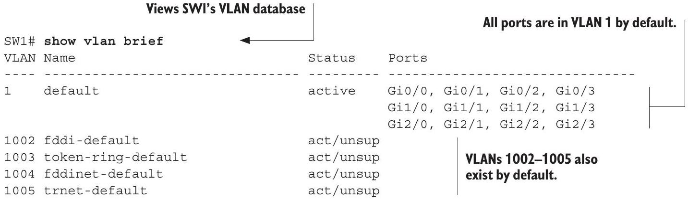

# Default VLAN

tags: #concept #acting-ccna #vlan

## Definition

Default VLAN 是 switch ports 在未額外設定時所屬的 VLAN；Cisco switch 預設通常所有 access ports 都在 VLAN 1。

## Why It Exists

它提供 switch 的預設 Layer 2 forwarding domain，但實務上也提醒管理者需要主動規劃 VLAN，而不是讓所有 ports 永遠留在同一 VLAN。

## Related Concepts

- [[VLAN]]
- [[Access Port]]
- [[VLAN ID]]

## Mechanism

`show vlan brief` 可看到 switch 上存在的 VLAN 與 access port membership。未設定時，ports 通常列在 VLAN 1。

## Source Figures

*Source: [[00_Source/Chapter 12 - VLAN]], Section 12.2.1 — `show vlan brief` output before configuring VLANs, showing default VLAN membership.*

## Appears In

- [[02_Source_Notes/Unit05-SubVLAN|Unit05：Subnetting 與 VLAN]]
