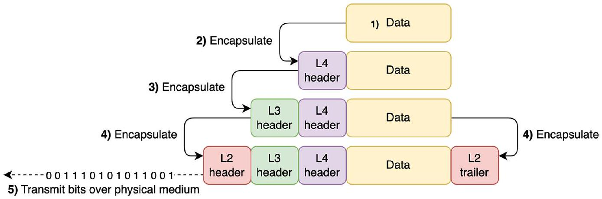
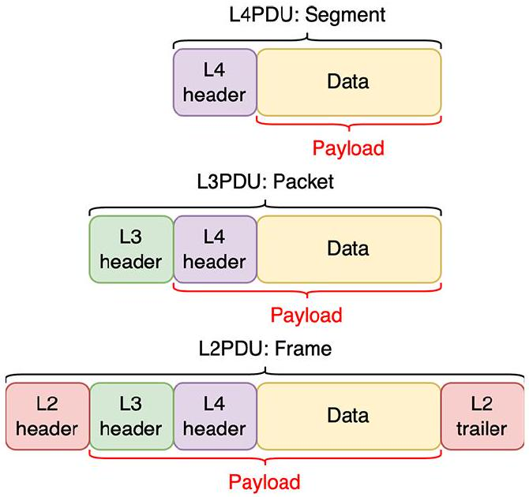

# Header and Trailer

tags: #concept #acting-ccna #network-fundamentals

## Aliases

- Header
- Trailer

## Definition

Header is supplemental data added to the front of a message. Trailer is supplemental data added to the end of a message.

## Why It Exists

Each protocol needs to carry information required by that layer, such as destination port, destination IP address, destination MAC address, or error-checking data.

## Related Concepts

- [[Encapsulation and De-encapsulation]]
- [[Protocol Data Unit]]
- [[Payload]]

## Mechanism

- Layer 4 adds a header addressed to a destination port number.
- Layer 3 adds a header addressed to the destination IP address.
- Layer 2 adds a header addressed to the next-hop MAC address and a trailer used to check for errors.

## Source Figures

*Source: [[00_Source/Chapter 4 - TCP IP 網路模型|Chapter 4 - TCP IP 網路模型]], Figure 4.5 — Layer 4 and Layer 3 add headers; Layer 2 adds both a header and trailer.*

*Source: [[00_Source/Chapter 4 - TCP IP 網路模型|Chapter 4 - TCP IP 網路模型]], Figure 4.7 — PDUs show headers/trailer wrapping the payload from upper layers.*

## Appears In

- [[02_Source_Notes/Unit02-TCPIP-網路模型|Unit02：TCP/IP 網路模型]]
