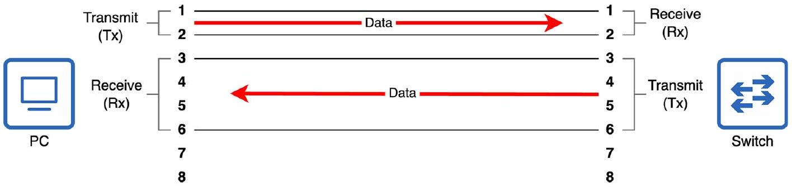
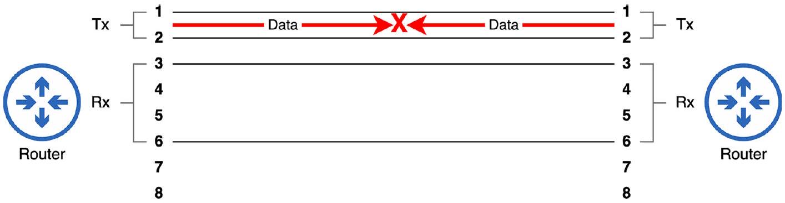
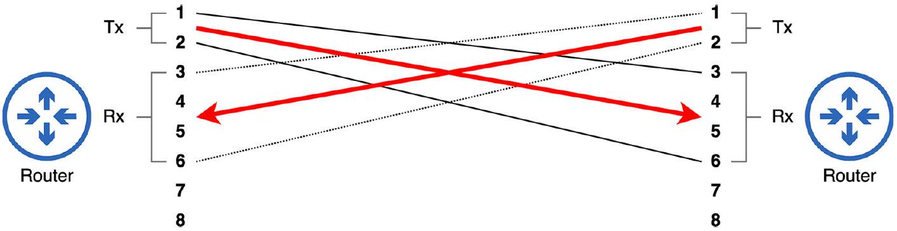

# Straight-through and Crossover Cable

tags: #concept #acting-ccna #network-fundamentals #cabling

## Aliases

- Straight-through cable
- Crossover cable
- 直通線與交叉線

## Definition

Straight-through 與 Crossover 是 UTP 線材兩端 pins 對接方式不同所形成的線材類型。

## Why It Exists

在 10BASE-T 與 100BASE-T 連線中，設備必須讓一端的 Tx pins 接到另一端的 Rx pins，否則無法通訊。

## Prerequisites

- [[UTP Cable]]
- [[8P8C Connector]]

## Related Concepts

- [[Auto MDI-X]]
- [[Switch]]
- [[Router]]

## Mechanism

- Straight-through：一端 pin pair 連到另一端相同 pin pair。
- Crossover：一端 pins 1/2 連到另一端 pins 3/6。
- PC/Server/Router/Firewall 通常使用 pins 1/2 Tx、pins 3/6 Rx。
- Switch 通常相反：pins 3/6 Tx、pins 1/2 Rx。

## Leads To

- [[Auto MDI-X]]：現代設備可自動調整 pins，降低選錯線材的問題。

## Source Figures

*Source: [[00_Source/Chapter 3 - 線材、接頭與連接埠|Chapter 3 - 線材、接頭與連接埠]], Figure 3.3 — A PC and a switch connected via a straight-through cable.*

*Source: [[00_Source/Chapter 3 - 線材、接頭與連接埠|Chapter 3 - 線材、接頭與連接埠]], Figure 3.4 — Two routers connected via a straight-through cable; communication fails because both routers transmit using the same pin pair.*

*Source: [[00_Source/Chapter 3 - 線材、接頭與連接埠|Chapter 3 - 線材、接頭與連接埠]], Figure 3.5 — Two routers connected via a crossover cable; one router's Tx pin pair connects to the other router's Rx pin pair.*

## Appears In

- [[02_Source_Notes/Unit01-設備-線材|Unit01：設備與線材]]

## Questions

- 為什麼 PC-to-Switch 使用 straight-through 可以通訊，但 Router-to-Router 可能需要 crossover？
