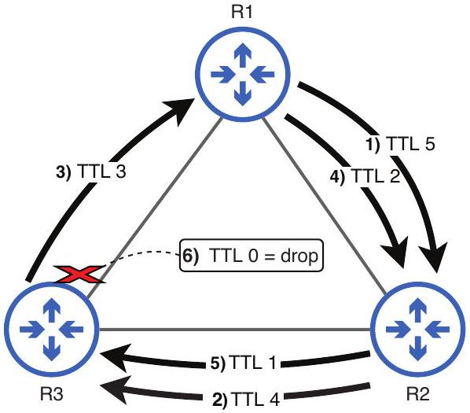

# Time To Live

tags: #concept #acting-ccna #ipv4 #routing

## Aliases

- TTL

## Definition

Time To Live 是 IPv4 header 的 8-bit 欄位；每經過一台 router 會減 1，到 0 時 packet 被丟棄。

## Why It Exists

TTL 防止 packet 在 routing loop 中無限循環，避免浪費網路資源。

## Related Concepts

- [[IPv4 Header]]
- [[Router]]
- [[Forwarding]]
- [[ICMP]]

## Mechanism

Host 設定初始 TTL，router 每 forwarding 一次就 decrement。若 decrement 後到 0，router 會 drop packet。

## Source Figures

*Source: [[00_Source/Chapter 7 - IPv4 位址|Chapter 7 - IPv4 位址]], Figure 7.3 — A looping packet is dropped when TTL reaches 0.*

## Appears In

- [[02_Source_Notes/Unit03-CLI-Eth-IPV4|Unit03：CLI、Ethernet Switching 與 IPv4]]

## Unit04 Additions

- In the [[Packet Life Cycle]], each router that forwards the packet decrements TTL before sending it onward.
- TTL connects route forwarding behavior to loop-prevention troubleshooting.

## Additional Appears In

- [[02_Source_Notes/Unit4-RouterSwitch-Packet|Unit04：Router / Switch 介面、路由與封包生命週期]]
