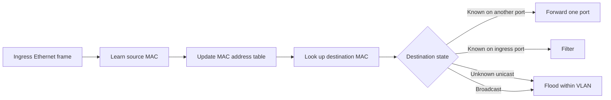

# Ethernet Switching

tags: #concept #acting-ccna #ethernet #switching #layer2

## Definition

Ethernet Switching 是 switch 根據 Ethernet frame 的 source/destination MAC addresses，學習 Layer 2 可達位置並決定 frame 應該單點轉送、泛洪或過濾的機制。

## Why It Exists

多個 hosts 共用 LAN 時，需要一個不要求終端理解 topology 的中間系統。Ethernet switch 以動態學習建立 forwarding state，使已知目的地的 traffic 只走必要 port，同時仍能處理未知目的地與 broadcast discovery。

## Prerequisites

- [[Ethernet]]
- [[Ethernet Frame]]
- [[MAC Address]]
- [[Switch]]
- [[Layer 2 Domain]]

## Concept Structure

```text
Ethernet Switching（核心）
├── MAC Address Learning：讀取 source MAC，建立可達位置
│   └── MAC Address Table：保存 MAC / VLAN / port 狀態與 aging
├── Frame Forwarding：讀取 destination MAC，選擇 egress action
│   ├── Known unicast：單點轉送或過濾
│   ├── Unknown unicast：在同一 Layer 2 domain 內 flooding
│   └── Broadcast：在同一 broadcast domain 內 flooding
└── ARP：先取得 next-hop MAC，才有可封裝與轉送的 Ethernet frame
```

## Input → State → Decision → Output



學習與轉送是兩個方向相反但連續的動作：switch 從 source MAC 學「來源在哪裡」，再以 destination MAC 決定「frame 要往哪裡去」。

## Core Mechanism

1. Switch 接收 frame，先驗證 frame 是否可處理。
2. [[MAC Address Learning]] 將 source MAC、ingress port 與 VLAN context 寫入或更新 [[MAC Address Table]]。
3. [[Frame Forwarding]] 查詢 destination MAC。
4. 已知 unicast 且位於其他 port：只轉送到該 port。
5. 已知 destination 位於 ingress port：filter，不再送回來源 segment。
6. Unknown unicast 或 broadcast：使用 [[Frame Flooding]]，但僅限同一 VLAN / broadcast domain 的適用 ports。

## ARP's Position

Switch 不使用 ARP 來決定 Layer 2 egress port；它查的是 MAC address table。[[Address Resolution Protocol]] 是 host/router 用來取得 next-hop MAC 的機制。ARP request/reply 本身形成 Ethernet frames，才由 switch 依上述規則轉送。

```text
Host: destination IP → ARP → next-hop MAC
Switch: destination MAC → MAC table → egress action
```

## Design Invariants

- Learning 查 source MAC；forwarding 查 destination MAC。
- MAC address table 與 ARP cache 是不同設備、不同 key/value、不同目的的狀態表。
- Switch forwarding 不會把一個 IP packet route 到另一 subnet，也通常不修改 frame 的 source/destination MAC。
- Flooding 有 Layer 2 boundary；在 VLAN-aware network 中不會任意跨 VLAN。
- Dynamic state 會 aging；短暫出現 unknown-unicast flooding 不一定代表故障。

## Failure Model

| 現象 | 優先檢查 |
|---|---|
| 所有 unknown unicast 都大量 flooding | MAC table 是否能學習、VLAN topology 是否穩定 |
| 特定 host 移動後短暫無法通訊 | MAC entry 是否仍指向舊 port、是否已重新學習 |
| ARP request 可見但沒有 reply | 目標 IP/subnet、host 狀態、VLAN/broadcast boundary |
| ARP reply 已收到但 data frame 未到達 | ARP cache、destination MAC、MAC table 與 egress port |
| 同 MAC 在 ports 間反覆移動 | Layer 2 loop、錯誤接線或實際 host mobility |

## Verification

```text
show mac address-table
show mac address-table dynamic
show interfaces counters errors
show interfaces switchport
show vlan brief
show interfaces trunk
arp -a
show ip arp
```

## Contrast

- [[MAC Address Table]] vs ARP cache：前者是 switch 的 MAC → port/VLAN forwarding state；後者是 host/router 的 IPv4 → MAC neighbor mapping。
- Forward vs flood：forward 選定單一已知方向；flood 複製到同一 Layer 2 boundary 的多個適用 ports。
- Switching vs routing：switch 依 destination MAC 在同一 Layer 2 domain 內轉送；router 依 destination IP 連接不同 Layer 3 networks。

## Related Concepts

- [[MAC Address Learning]]
- [[MAC Address Table]]
- [[Frame Forwarding]]
- [[Frame Flooding]]
- [[Broadcast Frame]]
- [[Address Resolution Protocol]]
- [[VLAN]]

## Source Figures


*Source: [[00_Source/Chapter 6 - Ethernet LAN 交換|Chapter 6 - Ethernet LAN 交換]], Figure 6.3 — Switches learn source MAC addresses and associate them with ports.*


*Source: [[00_Source/Chapter 6 - Ethernet LAN 交換|Chapter 6 - Ethernet LAN 交換]], Figure 6.4 — Unknown-unicast flooding while MAC address tables are empty.*

## Knowledge Maps

- [[04_Maps/Ethernet Switching 與 ARP 地圖|Ethernet Switching 與 ARP 地圖]]

## Appears In

- [[02_Source_Notes/Unit03-CLI-Eth-IPV4|Unit03：CLI、Ethernet Switching 與 IPv4]]

## Questions

- 為什麼 switch 從 source MAC 學習，卻使用 destination MAC 做 forwarding decision？
- ARP 已成功時，為什麼 Ethernet switching 仍可能失敗？
- MAC entry aging 後的第一個 frame 為什麼可能被 flood，而後續 frames 又恢復單點 forwarding？
