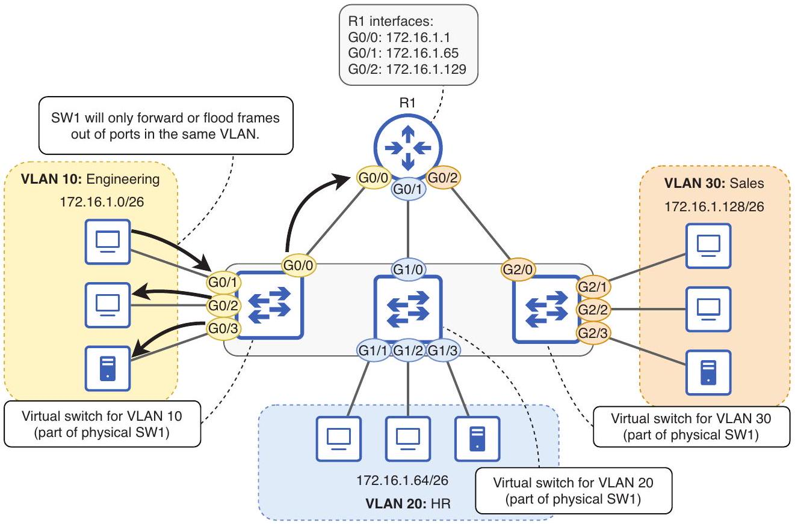

# VLAN

tags: #concept #acting-ccna #vlan #layer2

## Aliases

- Virtual LAN
- Virtual Local Area Network
- 虛擬區域網路

## Definition

VLAN 是在同一 physical switching infrastructure 中建立的 virtual LAN；每個 VLAN 形成獨立的 Layer 2 broadcast domain。

## Why It Exists

只用 subnetting 做 Layer 3 segmentation 不一定能阻止 Layer 2 broadcast 在 shared switch 上擴散。VLAN 讓 switch 只在同一 VLAN 內 forward/flood frames。

## Prerequisites

- [[Switch]]
- [[Ethernet Frame]]
- [[Broadcast Domain]]
- [[Layer 2 Domain]]

## Related Concepts

- [[Layer 2 Segmentation]]
- [[Layer 3 Segmentation]]
- [[Access Port]]
- [[Trunk Port]]
- [[VLAN ID]]
- [[Inter-VLAN Routing]]
- [[13-Dynamic Trunking Protocol]]
- [[13-VLAN Trunking Protocol]]

## Concept Structure

```text
VLAN（Layer 2 segmentation 核心）
├── Access Port：把終端設備接入單一 VLAN
├── Trunk Port：讓多個 VLAN 共用同一條實體連線
│   ├── IEEE 802.1Q Tag：跨 trunk 保存 VLAN 身分
│   ├── Native VLAN：處理 trunk 上的 untagged frames
│   └── Allowed VLAN List：限制可通過 trunk 的 VLAN
├── Inter-VLAN Routing：恢復不同 VLAN 之間的受控通訊
│   ├── Router on a Stick：router subinterfaces + trunk
│   └── Multilayer Switch：SVIs + internal Layer 3 routing
├── DTP：協商 access/trunk operational mode
└── VTP：在 switches 間同步 VLAN database
```

這棵樹區分三種容易混淆的工作：VLAN 建立隔離邊界；trunk 延伸這個邊界；inter-VLAN routing 才讓不同邊界之間重新通訊。DTP 與 VTP 都不是 VLAN forwarding 的必要條件，而是 Cisco 提供的控制與自動化機制。

## Mechanism

### 1. 建立 Layer 2 邊界

Switch ports 被指派到不同 VLAN 後，switch 會分別維護各 VLAN 的 forwarding context。Broadcast、unknown unicast 與需要 flooding 的 frames，只會在同一 VLAN 的適用 ports 內傳送。

### 2. 將終端接入 VLAN

[[Access Port]] 把收到的 untagged frame 歸入其設定的 access VLAN。終端通常不需要理解 802.1Q tag；VLAN membership 由 switch port configuration 決定。

### 3. 跨連線保存 VLAN 身分

多個 VLAN 要跨 switch-to-switch 或 switch-to-router link 時，使用 [[Trunk Port]]。[[IEEE 802.1Q Tag]] 在共享連線上保存 VLAN ID；[[Native VLAN]] 定義 untagged frame 的歸屬；[[Allowed VLAN List]] 決定哪些 VLAN 可以通過該 trunk。

### 4. 在 VLAN 之間進行 Layer 3 forwarding

Switch 不會直接把 Layer 2 frame 從一個 VLAN 轉送到另一個 VLAN。Host 要把 packet 送到不同 VLAN 時，先交給 [[Default Gateway]]，再由 [[Inter-VLAN Routing]] 透過 router 或 multilayer switch 重新封裝並送入目的 VLAN。

## Design Invariants

- 通常一個 VLAN 對應一個 IP subnet；兩者分別建立 Layer 2 與 Layer 3 邊界。
- VLAN ID 相同不代表兩端必然可達；中間 trunk 還必須允許該 VLAN，且 VLAN 必須存在。
- VLAN 提供 segmentation，不等於提供安全策略；跨 VLAN 的控制仍需要 routing policy、ACL 或 firewall。
- DTP 可以協商 port role，但不建立 VLAN；VTP 可以同步 VLAN database，但不負責 data-plane forwarding。

## Failure Model

| 現象 | 優先檢查 |
|---|---|
| 同 VLAN、同 switch 無法通訊 | access VLAN、port 狀態、MAC address learning |
| 同 VLAN、跨 switch 無法通訊 | trunk operational state、allowed VLAN list、VLAN 是否存在 |
| Untagged traffic 被放進錯誤 VLAN | trunk 兩端 native VLAN 是否一致 |
| 不同 VLAN 無法通訊 | host IP/prefix、default gateway、ROAS subinterface 或 SVI、routing table |
| Port 意外形成 trunk | DTP mode 與 `switchport nonegotiate` |
| 多台 switch 的 VLAN database 異常變更 | VTP domain、mode、version 與 revision number |

## Operational Verification

```text
show vlan brief
show interfaces switchport
show interfaces trunk
show mac address-table
show ip interface brief
show ip route
show vtp status
```

驗證時應先確認 VLAN 與 port membership，再確認 trunk 是否承載該 VLAN，最後才檢查 inter-VLAN routing。這個順序對應「本地 VLAN → 跨 link VLAN → Layer 3 通訊」的依賴關係。

## Contrast

- [[Access Port]] vs [[Trunk Port]]：前者把單一 VLAN 提供給終端；後者在基礎設施連線上承載多個 VLAN。
- VLAN vs subnet：VLAN 限制 Layer 2 flooding；subnet 定義 Layer 3 on-link boundary。
- Trunking vs routing：trunk 延伸同一 VLAN；routing 連接不同 VLAN/subnets。
- DTP vs VTP：DTP 協商 port 是否成為 trunk；VTP 同步 VLAN database，兩者名稱相近但功能不同。

## Source Figures


*Source: [[00_Source/Chapter 12 - VLAN]], Figure 12.4 — A physical switch divided into three virtual switches / VLANs, each a separate broadcast domain.*

## Appears In

- [[02_Source_Notes/Unit05-SubVLAN|Unit05：Subnetting 與 VLAN]]

## Knowledge Maps

- [[04_Maps/VLAN Knowledge Map|VLAN Knowledge Map]]
- [[04_Maps/VLAN Trunking Troubleshooting|VLAN Trunking Troubleshooting]]

## Questions

- 為什麼 VLAN 可以降低 broadcast domain 範圍，但不會自動提供 VLAN 間通訊？
- 為什麼 trunk 已經 up，某個 VLAN 的 traffic 仍可能無法通過？
- DTP 與 VTP 都和 VLAN 有關，但它們分別控制什麼狀態？
