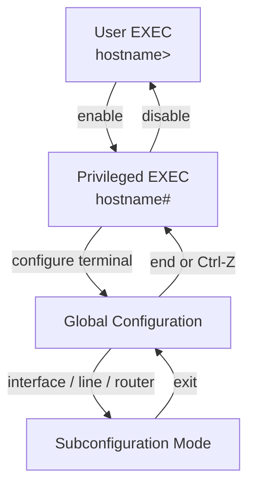
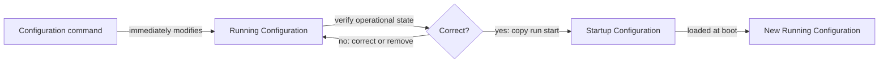

# Cisco IOS CLI 與 Configuration 地圖

tags: #map #acting-ccna #cli #configuration

## Scope

此 Map 整合管理存取、命令模式、設定生命週期與排錯順序；它描述的是可跨 VLAN、routing、security 等主題重複使用的 CLI 操作骨架。

## Concept Hierarchy

```text
[[Cisco IOS CLI]]
├── Access path
│   └── [[Console Port]] → [[Rollover Cable]] + [[Terminal Emulator]]
├── State machine
│   └── [[Cisco IOS Command Mode]]
└── Configuration state
    └── [[IOS Configuration File]]
```

## Mode State Machine



Durable relationships:

- [[Cisco IOS CLI]] **organized by** [[Cisco IOS Command Mode]].
- [[Cisco IOS Command Mode#User EXEC Mode|User EXEC Mode]] **leads to** [[Cisco IOS Command Mode#Privileged EXEC Mode|Privileged EXEC Mode]] through `enable`.
- [[Cisco IOS Command Mode#Privileged EXEC Mode|Privileged EXEC Mode]] **leads to** [[Cisco IOS Command Mode#Global Configuration Mode|Global Configuration Mode]] through `configure terminal`.
- [[Cisco IOS Command Mode#Global Configuration Mode|Global Configuration Mode]] **modifies** [[IOS Configuration File#Running Configuration|Running Configuration]].

## Configuration Lifecycle



Durable relationships:

- [[IOS Configuration File#Running Configuration|Running Configuration]] **is the currently effective state**.
- [[IOS Configuration File#Startup Configuration|Startup Configuration]] **is the boot-persistent state**.
- Saving **copies** running to startup; it does not prove the configuration is operationally correct.

## Local Access Chain

```text
PC → [[Terminal Emulator]] → console cable / [[Rollover Cable]]
   → [[Console Port]] → [[Cisco IOS CLI]]
```

## Troubleshooting Flow

```text
Cannot configure or expected function does not work
  ↓
Is the management session usable?
  ├── No → check Console Port / cable / Terminal Emulator
  └── Yes → Does prompt show the required Command Mode?
              ├── No → navigate modes; use ?
              └── Yes → Is intended configuration in running-config?
                           ├── No → correct command or target context
                           └── Yes → Does operational output match intent?
                                      ├── No → troubleshoot feature prerequisites
                                      └── Yes → save if it must survive reload
```

## Contrasts

| 容易混淆 | 關鍵差異 |
|---|---|
| EXEC vs configuration mode | 查詢／操作 vs 修改 running configuration |
| Running vs startup configuration | 現在生效 vs 下次開機載入 |
| Apply vs save | 改變目前狀態 vs 建立 reload 後的持久狀態 |
| Console port vs Ethernet port | 本機管理入口 vs 一般網路資料傳輸 |
| `enable password` vs `enable secret` | 舊式較弱儲存 vs hash 儲存且優先使用 |

## Source Scope

- [[02_Source_Notes/Unit03-CLI-Eth-IPV4|Unit03：CLI、Ethernet Switching 與 IPv4]]
