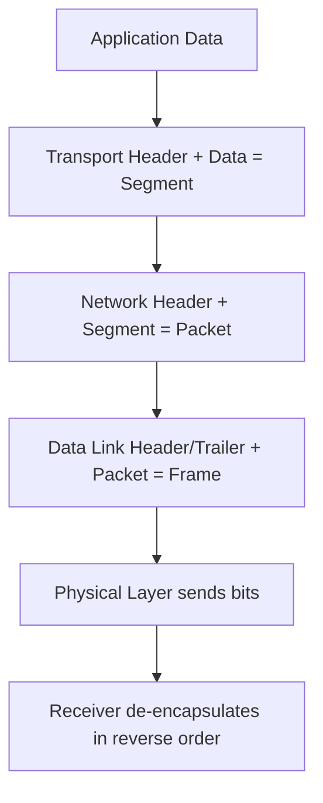
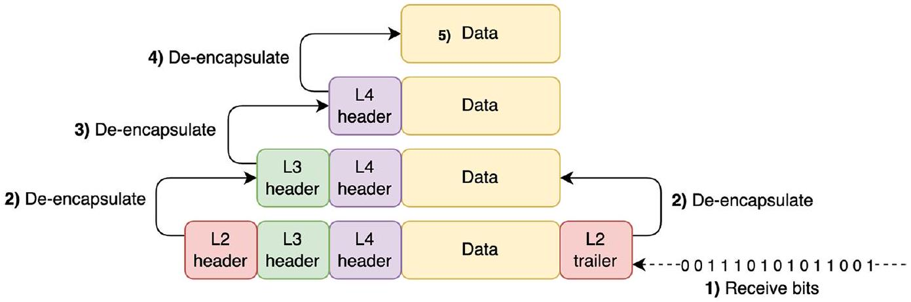
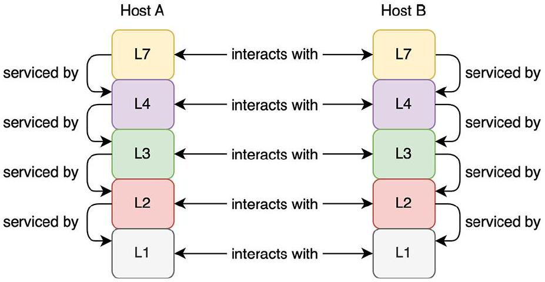

# Encapsulation 與 PDU 地圖

tags: #map #acting-ccna #encapsulation #pdu

## Scope

- Unit：[[01_Units/Unit02-TCPIP-網路模型|Unit02-TCPIP-網路模型]]
- Source：[[00_Source/Chapter 4 - TCP IP 網路模型|Chapter 4 - TCP IP 網路模型]]

## Process Map

## Concept Relationships

- [[Encapsulation and De-encapsulation]] → uses → [[Header and Trailer]]
- [[Header and Trailer]] → creates or identifies → [[Protocol Data Unit]]
- [[Protocol Data Unit]] → carries → [[Payload]]
- [[Payload]] → can contain upper-layer data and headers.
- [[Adjacent-layer Interaction]] → explains how one layer provides services to the layer above or below.
- [[Same-layer Interaction]] → explains how matching layers on different hosts appear to communicate using the same protocol rules.

## PDU Naming

| TCP/IP layer | Common PDU name in Chapter 4 | Key idea |
|---|---|---|
| Transport | Segment | Adds transport header, such as port information. |
| Network | Packet | Adds IP header for end-to-end logical delivery. |
| Data Link | Frame | Adds data-link header/trailer for hop-by-hop delivery. |
| Physical | Bits | Transmits physical signals over the medium. |

## Source Figures

*Source: [[00_Source/Chapter 4 - TCP IP 網路模型|Chapter 4 - TCP IP 網路模型]], Figure 4.5 — PC1 encapsulates data from the application layer down to the physical layer before transmission.*

*Source: [[00_Source/Chapter 4 - TCP IP 網路模型|Chapter 4 - TCP IP 網路模型]], Figure 4.6 — SRV1 receives bits and de-encapsulates data upward through the TCP/IP layers.*

*Source: [[00_Source/Chapter 4 - TCP IP 網路模型|Chapter 4 - TCP IP 網路模型]], Figure 4.7 — Segment, packet, and frame show how each layer treats upper-layer data as payload.*

*Source: [[00_Source/Chapter 4 - TCP IP 網路模型|Chapter 4 - TCP IP 網路模型]], Figure 4.8 — Adjacent-layer and same-layer interactions in the TCP/IP model.*

## REVIEW

- 集中 REVIEW 紀錄：[[06_review/Unit02-TCPIP-網路模型 REVIEW|Unit02-TCPIP-網路模型 REVIEW]]

