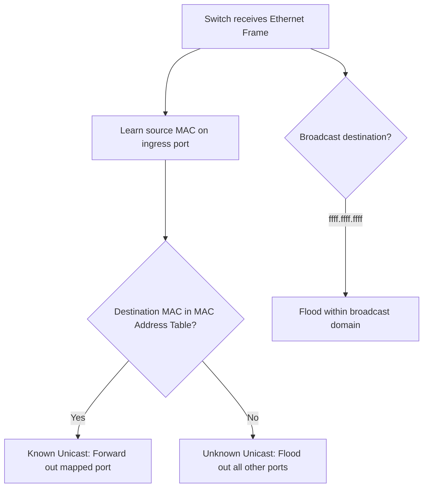
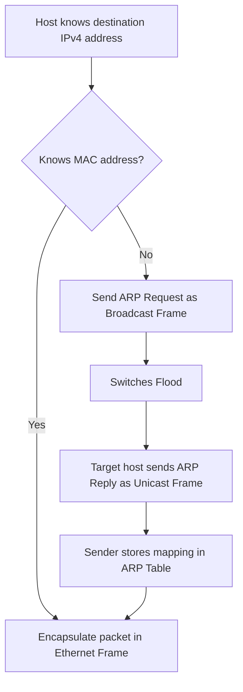

# Ethernet Switching 與 ARP 地圖

tags: #map #acting-ccna #ethernet #switching #arp

## Scope

- Source Note：[[02_Source_Notes/Unit03-CLI-Eth-IPV4|Unit03：CLI、Ethernet Switching 與 IPv4]]
- Source：[[00_Source/Chapter 6 - Ethernet LAN 交換|Chapter 6 - Ethernet LAN 交換]]

## Switching Decision Flow

## ARP Flow

## Important Relationships

- [[Ethernet Frame]] → Source field → [[MAC Address Learning]]
- [[MAC Address Learning]] → [[MAC Address Table]]
- [[MAC Address Table]] → determines → [[Frame Forwarding]] vs [[Frame Flooding]]
- [[Unknown Unicast Frame]] → causes → [[Frame Flooding]]
- [[Broadcast Frame]] → causes → [[Frame Flooding]]
- [[Address Resolution Protocol]] → uses broadcast first, then unicast reply
- [[ARP Table]] → reduces repeated ARP requests

## Source Figures

*Source: [[00_Source/Chapter 6 - Ethernet LAN 交換|Chapter 6 - Ethernet LAN 交換]], Figure 6.3 — Switches build MAC address tables by learning source MAC addresses.*

*Source: [[00_Source/Chapter 6 - Ethernet LAN 交換|Chapter 6 - Ethernet LAN 交換]], Figure 6.4 — Unknown unicast flooding when MAC address tables are empty.*

*Source: [[00_Source/Chapter 6 - Ethernet LAN 交換|Chapter 6 - Ethernet LAN 交換]], Figure 6.6 — ARP request and reply exchange between PC1 and PC3.*

## REVIEW

- 集中 REVIEW 紀錄：[[06_review/Unit03-CLI-Eth-IPV4 REVIEW|Unit03-CLI-Eth-IPV4 REVIEW]]

