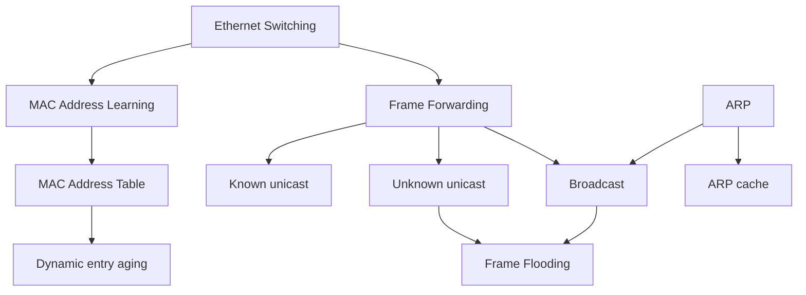
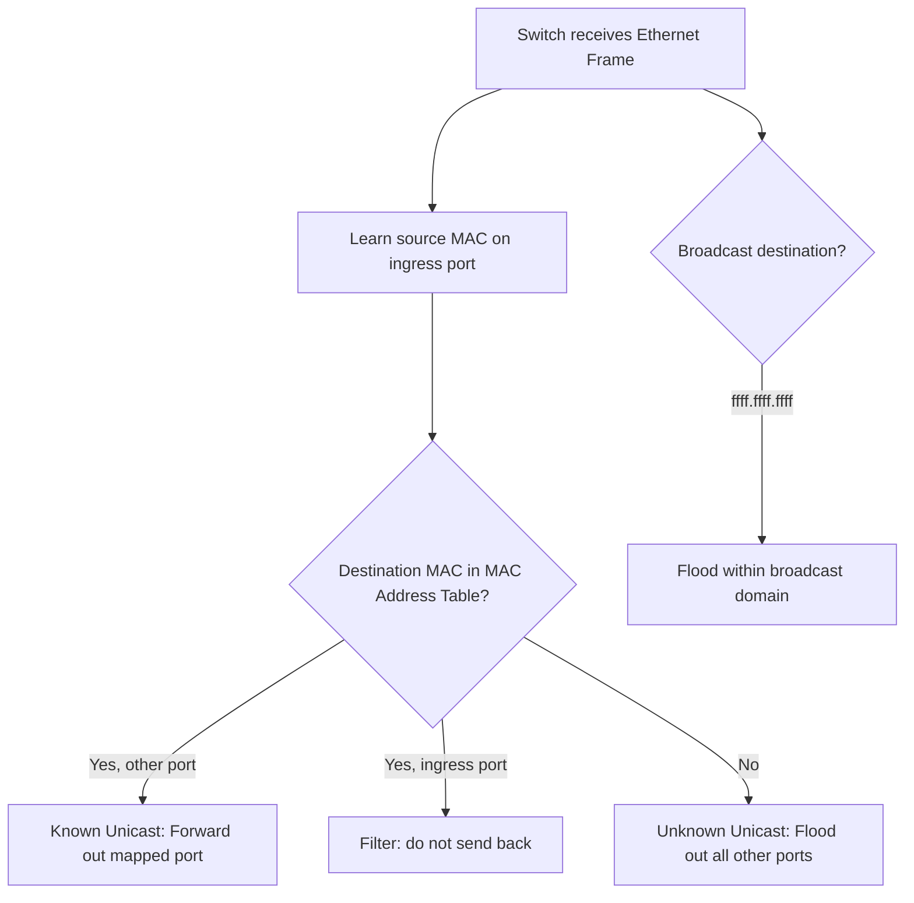
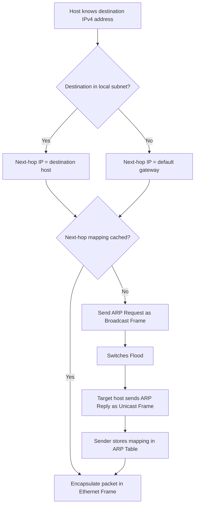
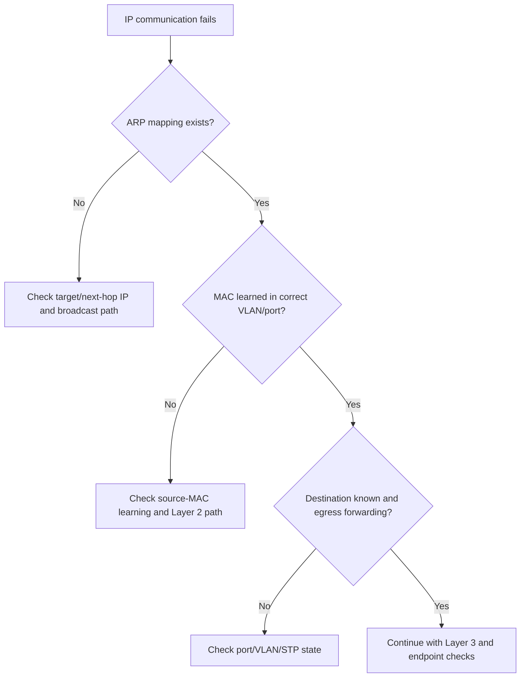

# Ethernet Switching 與 ARP 地圖

tags: #map #acting-ccna #ethernet #switching #arp

## Scope

- Source Note：[[02_Source_Notes/Unit03-CLI-Eth-IPV4|Unit03：CLI、Ethernet Switching 與 IPv4]]
- Source：[[00_Source/Chapter 6 - Ethernet LAN 交換|Chapter 6 - Ethernet LAN 交換]]
- Core concepts：[[Ethernet Switching]]、[[MAC Address Learning]]、[[Frame Forwarding]]、[[Address Resolution Protocol]]

## Concept Structure

## Switching Decision Flow

## ARP Flow

## Important Relationships

- [[Ethernet Frame]] → Source field → [[MAC Address Learning]]
- [[MAC Address Learning]] → [[MAC Address Table]]
- [[MAC Address Table]] → determines → [[Frame Forwarding]] vs [[Frame Flooding]]
- [[Frame Forwarding#Unknown Unicast Decision|Unknown Unicast]] → causes → [[Frame Flooding]]
- [[Broadcast Frame]] → causes → [[Frame Flooding]]
- [[Address Resolution Protocol]] → uses broadcast first, then unicast reply
- [[Address Resolution Protocol#ARP Cache (ARP Table)|ARP Table]] → reduces repeated ARP requests
- [[MAC Address Table#Dynamic Entries and Aging|MAC Aging]] → removes stale Layer 2 forwarding state
- ARP cache and [[MAC Address Table]] → are complementary, not interchangeable
- Remote-subnet destination → causes host to ARP for → [[Default Gateway]], not the remote host

## State Tables Compared

| Table | Owner | Key → value | Question answered |
|---|---|---|---|
| [[MAC Address Table]] | Switch | MAC + VLAN → port | 這個 frame 應從哪個 port 送出？ |
| [[Address Resolution Protocol#ARP Cache (ARP Table)|ARP cache]] | Host／router | IPv4 → MAC | 要建立 next-hop frame 時應使用哪個 MAC？ |

## Troubleshooting Flow

## Core Boundaries

- ARP failure：sender 無法取得建立 next-hop Ethernet frame 所需的 MAC。
- MAC-learning failure：switch 無法建立可靠的 MAC/VLAN/port state。
- Forwarding failure：state 存在，但 egress selection 或 port/VLAN state 阻止 frame 通過。
- Flooding：可能是正常 discovery/fallback，也可能因 learning instability 而持續發生。

## Source Figures

*Source: [[00_Source/Chapter 6 - Ethernet LAN 交換|Chapter 6 - Ethernet LAN 交換]], Figure 6.3 — Switches build MAC address tables by learning source MAC addresses.*

*Source: [[00_Source/Chapter 6 - Ethernet LAN 交換|Chapter 6 - Ethernet LAN 交換]], Figure 6.4 — Unknown unicast flooding when MAC address tables are empty.*

*Source: [[00_Source/Chapter 6 - Ethernet LAN 交換|Chapter 6 - Ethernet LAN 交換]], Figure 6.6 — ARP request and reply exchange between PC1 and PC3.*

## REVIEW

- 集中 REVIEW 紀錄：[[06_review/Unit03-CLI-Eth-IPV4 REVIEW|Unit03-CLI-Eth-IPV4 REVIEW]]
