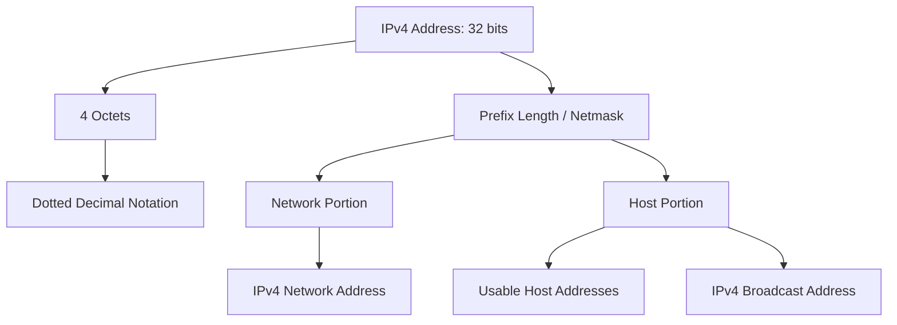
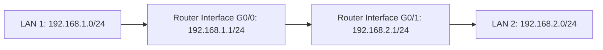

# IPv4 Addressing 基礎地圖

tags: #map #acting-ccna #ipv4 #subnetting

## Scope

- Source Note：[[02_Source_Notes/Unit03-CLI-Eth-IPV4|Unit03：CLI、Ethernet Switching 與 IPv4]]
- Source：[[00_Source/Chapter 7 - IPv4 位址|Chapter 7 - IPv4 位址]]

## Address Structure

## Router Context

## Important Relationships

- [[IPv4 Address]] → 32 bits → four [[Octet]]
- [[Octet]] → 8 bits → 0–255 decimal range
- [[Dotted Decimal Notation]] → makes IPv4 human-readable
- [[Prefix Length]] ↔ [[Netmask]] → two ways to express the network/host boundary
- [[Network Portion and Host Portion]] → determines same-network vs different-network logic
- [[IPv4 Network Address]] → first address, not assignable to host
- [[IPv4 Broadcast Address]] → last address, not assignable to host
- [[Usable IPv4 Address Range]] → from network address + 1 to broadcast address - 1
- [[IPv4 Address Class]] → historical classful boundary; later replaced by classless/subnetting concepts

## Source Figures

*Source: [[00_Source/Chapter 7 - IPv4 位址|Chapter 7 - IPv4 位址]], Figure 7.7 — IPv4 address in dotted decimal and binary, split into network and host portions.*

*Source: [[00_Source/Chapter 7 - IPv4 位址|Chapter 7 - IPv4 位址]], Figure 7.8 — Two LANs with different network portions connected by router R1.*

*Source: [[00_Source/Chapter 7 - IPv4 位址|Chapter 7 - IPv4 位址]], Figure 7.16 — Class A, B, and C network and host portion sizes.*

## REVIEW

- 集中 REVIEW 紀錄：[[06_review/Unit03-CLI-Eth-IPV4 REVIEW|Unit03-CLI-Eth-IPV4 REVIEW]]

