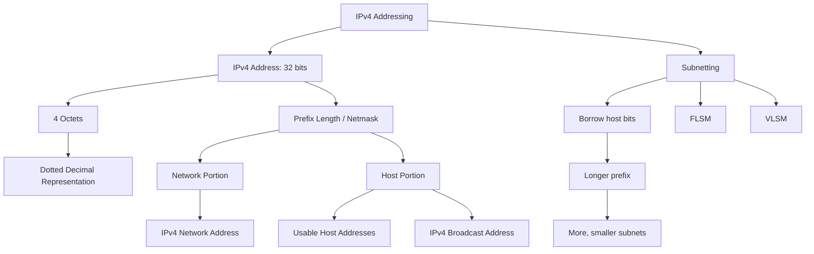
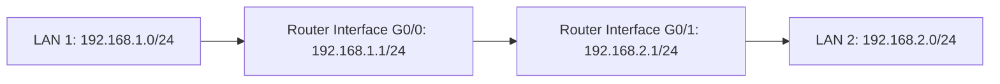
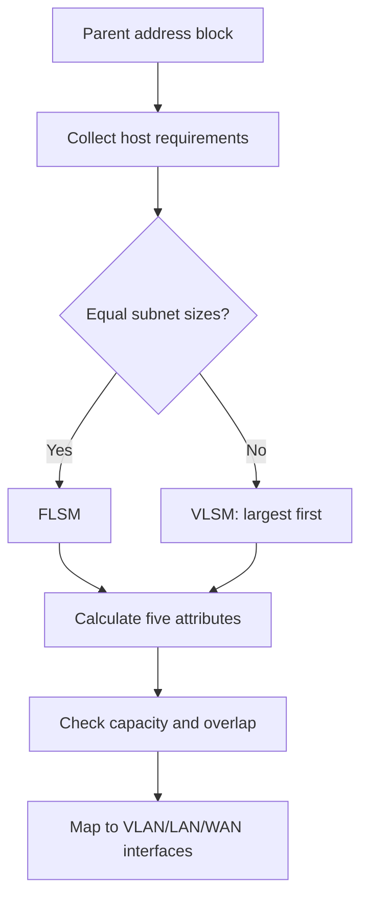

# IPv4 Addressing 與 Subnetting 地圖

tags: #map #acting-ccna #ipv4 #subnetting

## Scope

- Source Note：[[02_Source_Notes/Unit03-CLI-Eth-IPV4|Unit03：CLI、Ethernet Switching 與 IPv4]]
- Source：[[00_Source/Chapter 7 - IPv4 位址|Chapter 7 - IPv4 位址]]
- Extended source：[[00_Source/Chapter 11 - IPv4 網路子網劃分|Chapter 11 - IPv4 網路子網劃分]]
- Core concepts：[[IPv4 Addressing]]、[[IPv4 Address]]、[[Subnetting]]

## Address Structure

## Router Context

## Important Relationships

- [[IPv4 Address]] → 32 bits → four [[IPv4 Addressing#Representation|octets]]
- [[IPv4 Addressing#Representation|Octet]] → 8 bits → 0–255 decimal range
- [[IPv4 Addressing#Representation|Dotted Decimal Notation]] → makes IPv4 human-readable
- [[Prefix Length]] ↔ [[Netmask]] → two ways to express the network/host boundary
- [[Network Portion and Host Portion]] → determines same-network vs different-network logic
- [[IPv4 Network Address]] → first address, not assignable to host
- [[IPv4 Broadcast Address]] → last address, not assignable to host
- [[Usable IPv4 Address Range]] → from network address + 1 to broadcast address - 1
- [[IPv4 Address Class]] → historical classful boundary; later replaced by classless/subnetting concepts
- [[Subnetting#Borrowing Bits|Borrowed Bits]] → extend → network/subnet portion
- Longer [[Prefix Length]] → produces → more subnets with fewer addresses each
- [[Subnetting#Five Subnet Attributes|Five Subnet Attributes]] → validate → network, broadcast, usable range, capacity
- [[Subnetting#Magic Number Method|Magic Number Method]] → accelerates → subnet-boundary calculation
- [[FLSM]] → uses → one shared prefix length
- [[VLSM]] → allocates → different prefix lengths according to requirements

## Address Planning Flow

## Troubleshooting Boundaries

- Representation error：binary/octet/dotted-decimal conversion 不正確。
- Boundary error：prefix/netmask 對 network/host portions 的切分不正確。
- Allocation error：subnets overlap、capacity 不足或 VLSM placement 不佳。
- Configuration error：計畫正確，但 interface address、mask 或 default gateway 實作錯誤。

## Source Figures

*Source: [[00_Source/Chapter 7 - IPv4 位址|Chapter 7 - IPv4 位址]], Figure 7.7 — IPv4 address in dotted decimal and binary, split into network and host portions.*

*Source: [[00_Source/Chapter 7 - IPv4 位址|Chapter 7 - IPv4 位址]], Figure 7.8 — Two LANs with different network portions connected by router R1.*

*Source: [[00_Source/Chapter 7 - IPv4 位址|Chapter 7 - IPv4 位址]], Figure 7.16 — Class A, B, and C network and host portion sizes.*

## REVIEW

- 集中 REVIEW 紀錄：[[06_review/Unit03-CLI-Eth-IPV4 REVIEW|Unit03-CLI-Eth-IPV4 REVIEW]]
