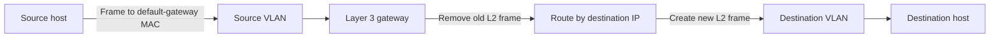
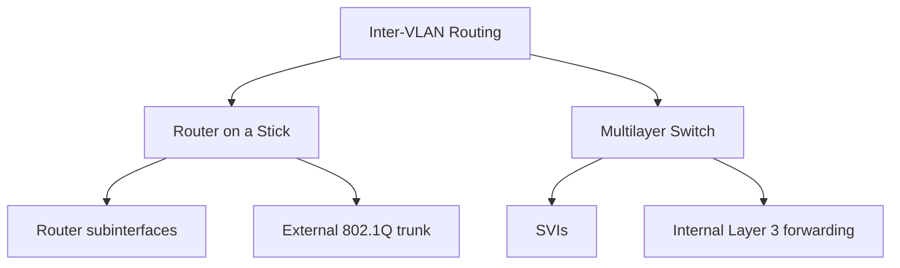

# Inter-VLAN Routing Packet Flow

## Purpose

這份 Map 是 [[Inter-VLAN Routing]] 的流程入口，整理所有實作方式都不變的 forwarding 規則，並連結兩種主要實作的詳細流程。

## Common Packet Flow



1. Source host 以自己的 prefix 判斷 destination 位於其他 subnet。
2. Source host 保留最終 destination IP，但把 frame 的 destination MAC 設為本 VLAN default gateway。
3. Gateway 移除 ingress Layer 2 frame，遞減 TTL，並依 destination IP 查詢 routing table。
4. Gateway 解析 egress next-hop/destination MAC，建立新的 Ethernet frame。
5. Frame 若穿越 trunk，使用 [[IEEE 802.1Q Tag]] 保存目前所屬 VLAN；從 access port 送出前通常為 untagged。

## Packet Invariants

| 欄位／狀態 | 通過 Layer 3 gateway 時 |
|---|---|
| Source IP | 通常不變 |
| Destination IP | 通常不變 |
| TTL | 減 1 |
| Source MAC | 依新的 egress link 重建 |
| Destination MAC | 改成下一跳或最終 host MAC |
| 802.1Q tag | 依目前 link 與 VLAN 重新決定 |

## Implementation Branches



- [[04_Maps/12.4-Router-on-a-Stick-Packet-Flow|Router on a Stick Packet Flow]]：追蹤 access VLAN → tagged trunk → router subinterface → destination VLAN。
- [[04_Maps/12.4-Multilayer-Switching-Packet-Flow|Multilayer Switching Packet Flow]]：追蹤 access VLAN → source SVI → internal routing → destination SVI／routed port。

## Troubleshooting Boundary

```text
Host addressing
  ↓
Access VLAN membership
  ↓
Trunk / allowed VLAN / 802.1Q mapping
  ↓
Gateway interface or SVI state
  ↓
Routing table and return path
```

## Relationships

- [[VLAN]] isolation → requires → [[Inter-VLAN Routing]] for cross-VLAN communication
- [[Default Gateway]] → terminates → the source host's Layer 2 frame
- [[Routing Table]] → selects → the destination VLAN or next hop
- Layer 3 forwarding → replaces → the Ethernet header for the next link
- [[Trunk Port]] → transports VLAN-tagged frames but does not itself route between VLANs

## Appears In

- [[00_Source/Chapter 12 - VLAN|Chapter 12 — VLAN]]
- [[02_Source_Notes/Unit05-SubVLAN|Unit05：Subnetting 與 VLAN]]
