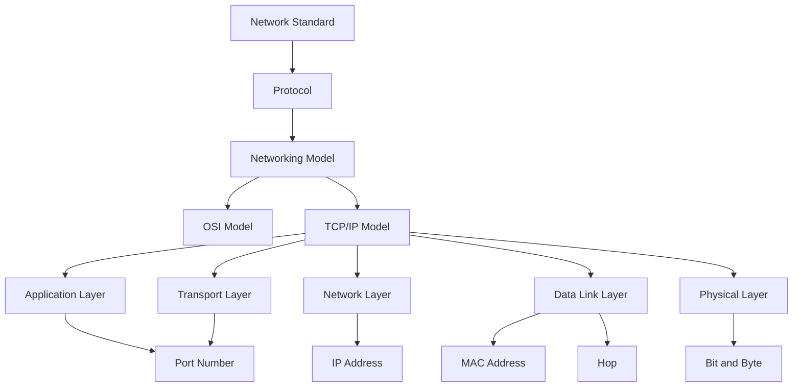

# Unit02：TCP/IP 網路模型知識地圖

tags: #map #acting-ccna #unit-map #tcpip-model

## Scope

- Unit：[[01_Units/Unit02-TCPIP-網路模型|Unit02-TCPIP-網路模型]]
- Source Note：[[02_Source_Notes/Unit02-TCPIP-網路模型|Unit02：TCP/IP 網路模型]]
- Source：[[00_Source/Chapter 4 - TCP IP 網路模型|Chapter 4 - TCP IP 網路模型]]

## Core Flow

## Model Relationships

- [[Network Standard]] → defines → [[Protocol]]
- [[Protocol]] → grouped into → [[Networking Model]]
- [[Networking Model]] → includes → [[OSI Model]]
- [[Networking Model]] → includes → [[TCP-IP Model]]
- [[OSI Model]] → contrasts with → [[TCP-IP Model]]
- [[TCP-IP Model]] → used as practical CCNA framework → [[Physical Layer]], [[Data Link Layer]], [[Network Layer]], [[Transport Layer]], [[Application Layer]]

## Layer Relationships

- [[Application Layer]] → provides user-facing network services and application protocols.
- [[Transport Layer]] → identifies the correct process by using [[Port Number]].
- [[Network Layer]] → supports end-to-end logical delivery by using [[IP Address]].
- [[Data Link Layer]] → supports hop-by-hop delivery by using [[MAC Address]].
- [[Physical Layer]] → moves bits through media such as [[UTP Cable]] and [[Fiber Optic Cable]].

## Delivery Relationships

- [[End Host]] → may act as client or server in application communication.
- [[Router]] → participates in Layer 3 forwarding between networks.
- [[Switch]] → participates in LAN forwarding, but Chapter 4 states that passing through a switch is not counted as a [[Hop]] in the example path.
- [[Forwarding]] → depends on address type by layer:
  - Layer 2：[[MAC Address]]
  - Layer 3：[[IP Address]]
  - Layer 4：[[Port Number]]

## Cross-document / Cross-unit Relationships Added

### Unit01 → Unit02

- [[Network Standard]] from Unit01 becomes more precise in Unit02 as a foundation for [[Protocol]] and [[Networking Model]].
- [[Ethernet]] from Unit01 now connects to [[Physical Layer]] and [[Data Link Layer]].
- [[UTP Cable]] and [[Fiber Optic Cable]] from Unit01 now serve as concrete examples of [[Physical Layer]] media.
- [[Bit and Byte]] from Unit01 now connects to [[Physical Layer]] transmission and [[Encapsulation and De-encapsulation]].
- [[End Host]] from Unit01 now connects to [[Application Layer]], [[IP Address]], and [[Port Number]].
- [[Switch]] from Unit01 now connects to [[Data Link Layer]], [[MAC Address]], and [[Hop]].
- [[Router]] from Unit01 now connects to [[Network Layer]], [[IP Address]], [[Hop]], and [[Forwarding]].
- [[Node]] from Unit01 now connects to [[Hop]] and [[Forwarding]] as part of network path analysis.

### Unit02 → Later Units

- [[Data Link Layer]], [[MAC Address]], [[Switch]], and [[Ethernet]] should lead into Chapter 6 Ethernet LAN switching.
- [[Network Layer]], [[IP Address]], and [[Router]] should lead into IPv4 / IPv6 addressing and routing Units.
- [[Transport Layer]] and [[Port Number]] should lead into Chapter 22 TCP and UDP.
- [[Application Layer]] should connect later to application protocols such as HTTP, HTTPS, FTP, SSH, and DNS when those become deeper study targets.

## REVIEW

- 集中 REVIEW 紀錄：[[06_review/Unit02-TCPIP-網路模型 REVIEW|Unit02-TCPIP-網路模型 REVIEW]]

