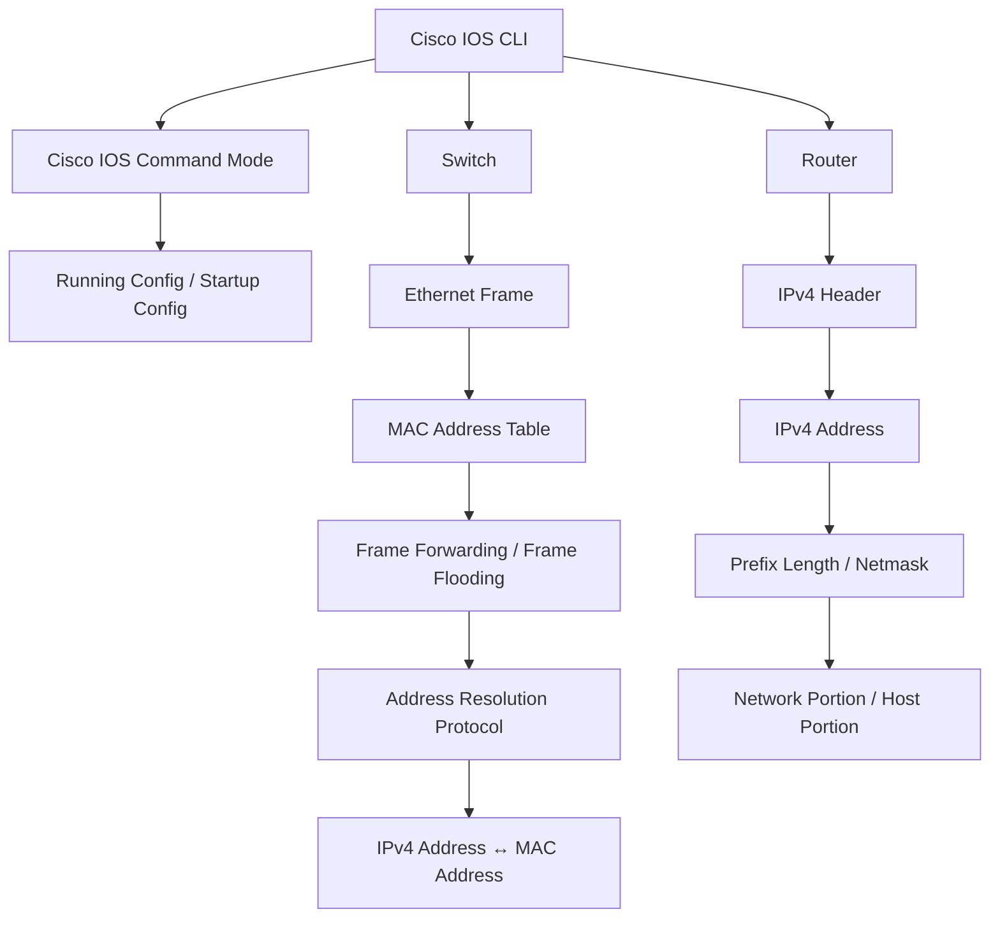

# Unit03：CLI、Ethernet、IPv4 知識地圖

tags: #map #acting-ccna #unit-map #cli #ethernet #ipv4

## Scope

- Unit：[[01_Units/Unit03-CLI-Eth-IPV4|Unit03-CLI-Eth-IPV4]]
- Source Note：[[02_Source_Notes/Unit03-CLI-Eth-IPV4|Unit03：CLI、Ethernet Switching 與 IPv4]]
- Sources：
  - [[00_Source/Chapter 5 - Cisco IOS CLI|Chapter 5 - Cisco IOS CLI]]
  - [[00_Source/Chapter 6 - Ethernet LAN 交換|Chapter 6 - Ethernet LAN 交換]]
  - [[00_Source/Chapter 7 - IPv4 位址|Chapter 7 - IPv4 位址]]

## Core Map

## CLI Relationships

- [[Cisco IOS CLI]] → used to configure and verify → [[Switch]] / [[Router]]
- [[Cisco IOS CLI]] → organized by → [[Cisco IOS Command Mode]]
- [[User EXEC Mode]] → `enable` → [[Privileged EXEC Mode]]
- [[Privileged EXEC Mode]] → `configure terminal` → [[Global Configuration Mode]]
- [[Global Configuration Mode]] → modifies → [[Running Config]]
- [[Running Config]] → must be saved into → [[Startup Config]]
- [[Enable Secret]] → safer replacement for → [[Enable Password]]

## Ethernet Switching Relationships

- [[Ethernet]] → creates Layer 2 PDU → [[Ethernet Frame]]
- [[Ethernet Frame]] → contains → source/destination [[MAC Address]]
- Source [[MAC Address]] → enables → [[MAC Address Learning]]
- [[MAC Address Learning]] → builds → [[MAC Address Table]]
- Known destination MAC → [[Frame Forwarding]]
- Unknown destination MAC → [[Frame Flooding]]
- [[Broadcast Frame]] → requires → [[Frame Flooding]]
- [[Switch]] → transparent to hosts → message through switch is not counted as [[Hop]]
- [[LAN]] → can be understood as → [[Layer 2 Domain]]
- [[Broadcast Domain]] → defines reach of → [[Broadcast Frame]]

## ARP and Ping Relationships

- [[Address Resolution Protocol]] → maps → [[IPv4 Address]] to [[MAC Address]]
- ARP request → uses → [[Broadcast Frame]]
- ARP reply → uses → [[Unicast Frame]]
- Learned mapping → stored in → [[ARP Table]]
- [[Ping]] → uses → [[ICMP]] echo request / reply
- [[Ping]] → requires at least usable addressing and forwarding path, but success/failure still needs careful troubleshooting interpretation.

## IPv4 Relationships

- [[IPv4 Header]] → contains → source/destination [[IPv4 Address]]
- [[IPv4 Address]] → represented by → [[Dotted Decimal Notation]]
- [[IPv4 Address]] → divided into four → [[Octet]]
- [[Octet]] → depends on → [[Binary Number System]]
- [[Prefix Length]] and [[Netmask]] → identify → [[Network Portion and Host Portion]]
- Host portion all 0 → [[IPv4 Network Address]]
- Host portion all 1 → [[IPv4 Broadcast Address]]
- [[Usable IPv4 Address Range]] → excludes → [[IPv4 Network Address]] and [[IPv4 Broadcast Address]]
- [[IPv4 Address Class]] → historical basis for → [[Classful Network]]
- Oversized packet → [[Packet Fragmentation]] when exceeding [[Maximum Transmission Unit]]
- Routing loop risk → mitigated by → [[Time To Live]]

## Cross-document / Cross-unit Relationships Added

### Unit02 → Unit03

- [[Data Link Layer]] from Unit02 is now concretized by [[Ethernet Frame]], [[MAC Address Table]], [[MAC Address Learning]], [[Frame Forwarding]], and [[Frame Flooding]].
- [[Network Layer]] from Unit02 is now concretized by [[IPv4 Header]], [[IPv4 Address]], [[Prefix Length]], and [[Netmask]].
- [[Encapsulation and De-encapsulation]] from Unit02 is reinforced by Chapter 7 Figure 7.2：packet must be encapsulated in a frame before transmission.
- [[MAC Address]] vs [[IP Address]] from Unit02 is extended by [[Address Resolution Protocol]], which maps IPv4 address to MAC address.
- Unit02 REVIEW item “Switch and Hop” is partially resolved：Chapter 6 explains that switch is transparent and does not modify frames, so traffic through a switch is not counted as a hop in the Chapter 4 sense.

### Unit01 → Unit03

- [[Switch]] from Unit01 now connects to [[MAC Address Table]], [[MAC Address Learning]], [[Frame Forwarding]], and [[Frame Flooding]].
- [[Router]] from Unit01 now connects to [[IPv4 Address]], [[IPv4 Header]], [[Time To Live]], and inter-LAN connectivity.
- [[LAN]] from Unit01 is refined into [[Layer 2 Domain]] and [[Broadcast Domain]].
- [[Bit and Byte]] from Unit01 now supports [[Binary Number System]], [[Octet]], and IPv4 conversion.
- [[Straight-through and Crossover Cable]] remains distinct from [[Rollover Cable]]：Ethernet traffic cable vs console-management cable.

### Unit03 → Later Units

- [[IPv4 Address]], [[Prefix Length]], [[Netmask]], and [[Usable IPv4 Address Range]] lead directly into Chapter 11 subnetting.
- [[MAC Address Table]], [[Frame Flooding]], and [[Broadcast Domain]] lead into VLANs, trunking, STP, and EtherChannel.
- [[Cisco IOS CLI]] and [[IOS Configuration File]] lead into all later configure / verify Units.
- [[Time To Live]], [[IPv4 Header]], and [[ICMP]] lead into routing and packet-life troubleshooting.

## REVIEW

- 集中 REVIEW 紀錄：[[06_review/Unit03-CLI-Eth-IPV4 REVIEW|Unit03-CLI-Eth-IPV4 REVIEW]]

