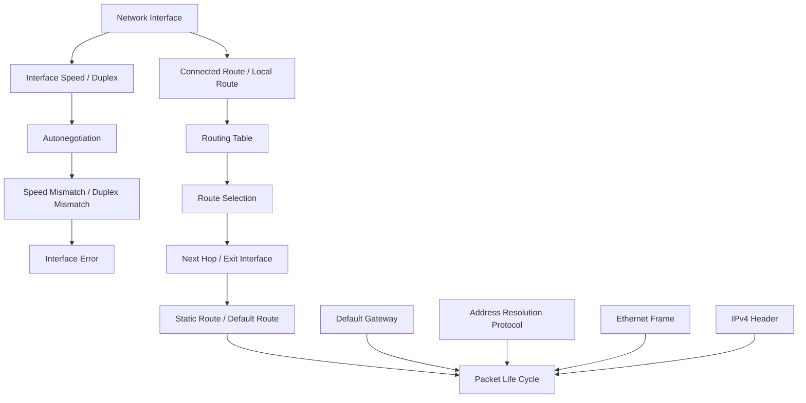

# Unit04：Router/Switch/Packet 知識地圖

tags: #map #acting-ccna #unit-map #routing #interface #packet-life-cycle

## Scope

- Unit：[[01_Units/Unit4-RouterSwitch-Packet|Unit4-RouterSwitch-Packet]]
- Source Note：[[02_Source_Notes/Unit4-RouterSwitch-Packet|Unit04：Router / Switch 介面、路由與封包生命週期]]
- Sources：
  - [[00_Source/Chapter 8 - Router 與 Switch 介面|Chapter 8 - Router 與 Switch 介面]]
  - [[00_Source/Chapter 9 - 路由基礎|Chapter 9 - 路由基礎]]
  - [[00_Source/Chapter 10 - 封包的一生|Chapter 10 - 封包的一生]]

## Core Map

## Interface Relationships

- [[Network Interface]] → configured / verified through → [[Cisco IOS CLI]]
- [[Network Interface]] → can have human-readable label → [[Interface Description]]
- [[Network Interface]] → operationally depends on compatible → [[Interface Speed]] and [[Duplex]]
- [[Autonegotiation]] → negotiates → [[Interface Speed]] and [[Duplex]]
- Manual/auto mismatch → may lead to → [[Duplex Mismatch]]
- Different speed settings → may lead to → [[Speed Mismatch]]
- [[Speed Mismatch]] / [[Duplex Mismatch]] → produces evidence in → [[Interface Error]]
- Hub/shared medium → creates larger → [[Collision Domain]]
- [[Collision Domain]] + half duplex → requires → [[CSMA-CD]]
- [[Switch]] → separates hosts into individual → [[Collision Domain]]

## Routing Relationships

- [[Router]] → makes forwarding decisions using → [[Routing Table]]
- Router interface with IP and up/up state → creates → [[Connected Route]]
- Router interface's own IP → creates → [[Local Route]]
- [[Routing Table]] → is searched by → [[Route Selection]]
- [[Route Selection]] → prefers more specific → [[Prefix Length]] match
- [[Static Route]] → manually adds reachability to → remote networks
- [[Recursive Static Route]] → specifies only → [[Next Hop]]
- [[Fully Specified Static Route]] → specifies both → [[Exit Interface]] and [[Next Hop]]
- [[Default Route]] → fallback when no more specific route exists
- [[Next Hop]] → requires MAC resolution via → [[Address Resolution Protocol]]
- [[Proxy ARP]] → may answer ARP if router has a route to the requested destination

## Packet Life-cycle Relationships

- End host remote destination decision → sends frame to → [[Default Gateway]]
- [[Default Gateway]] → acts as host's first → [[Next Hop]]
- [[Address Resolution Protocol]] → resolves MAC for → default gateway / next hop / final host
- [[Ethernet Frame]] → provides hop-to-hop delivery with changing → [[MAC Address]]
- [[IPv4 Header]] → provides end-to-end delivery with stable → [[IPv4 Address]] destination
- [[Router]] → de-encapsulates incoming frame, checks packet, then re-encapsulates for next link
- [[Packet Life Cycle]] → concretizes → [[Encapsulation and De-encapsulation]]
- [[Time To Live]] → is decremented by routers during → [[Packet Life Cycle]]

## Cross-document / Cross-unit Relationships Added

### Chapter 8 → Chapter 9

- [[Network Interface]] health is prerequisite to useful [[Connected Route]] and real forwarding. A route can be conceptually correct, but if interface speed/duplex/link state is wrong, packets cannot successfully traverse that link.
- [[Interface Speed]], [[Duplex]], and [[Autonegotiation]] turn physical/link compatibility into a routing prerequisite: routing decisions depend on working links.

### Chapter 9 → Chapter 10

- [[Routing Table]] and [[Route Selection]] explain the decision each router performs in [[Packet Life Cycle]].
- [[Static Route]] and [[Default Route]] provide the route entries that make Chapter 10's multi-router packet path possible.
- [[Next Hop]] / [[Exit Interface]] determine how each router builds the next Ethernet frame.

### Unit02 → Unit04

- [[Encapsulation and De-encapsulation]] from Unit02 is now represented as repeated hop-by-hop frame replacement in [[Packet Life Cycle]].
- Unit02's [[Data Link Layer]] vs [[Network Layer]] contrast is reinforced: Layer 2 MAC addresses change per hop; Layer 3 IP addresses remain end-to-end.

### Unit03 → Unit04

- [[IPv4 Address]], [[Prefix Length]], and [[Network Portion and Host Portion]] support host same-network vs remote-network decisions and router longest-prefix route selection.
- [[Address Resolution Protocol]] expands from same-LAN IP-to-MAC lookup into next-hop MAC resolution for default gateways and router-to-router forwarding.
- [[MAC Address Table]] and [[Frame Forwarding]] explain why switches in Chapter 10 can deliver ARP and data frames without becoming IP hops.

### Unit04 → Later Units

- [[Routing Table]], [[Route Selection]], [[Static Route]], and [[Default Route]] lead directly into dynamic routing, OSPF, administrative distance, route metrics, and troubleshooting.
- [[Network Interface]], [[Interface Error]], [[Speed Mismatch]], and [[Duplex Mismatch]] lead into later Layer 1/2 troubleshooting and switchport configuration topics.
- [[Packet Life Cycle]] becomes a reusable troubleshooting frame for ACL, NAT, firewall, VLAN, routing-loop, and traceroute topics.

## REVIEW

- 集中 REVIEW 紀錄：[[06_review/Unit4-RouterSwitch-Packet REVIEW|Unit4-RouterSwitch-Packet REVIEW]]
