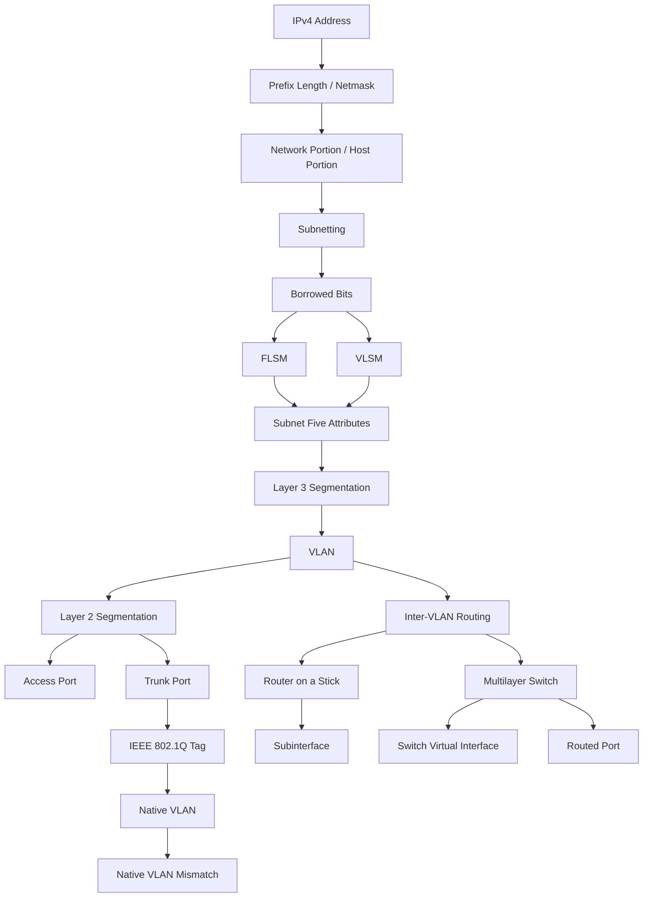
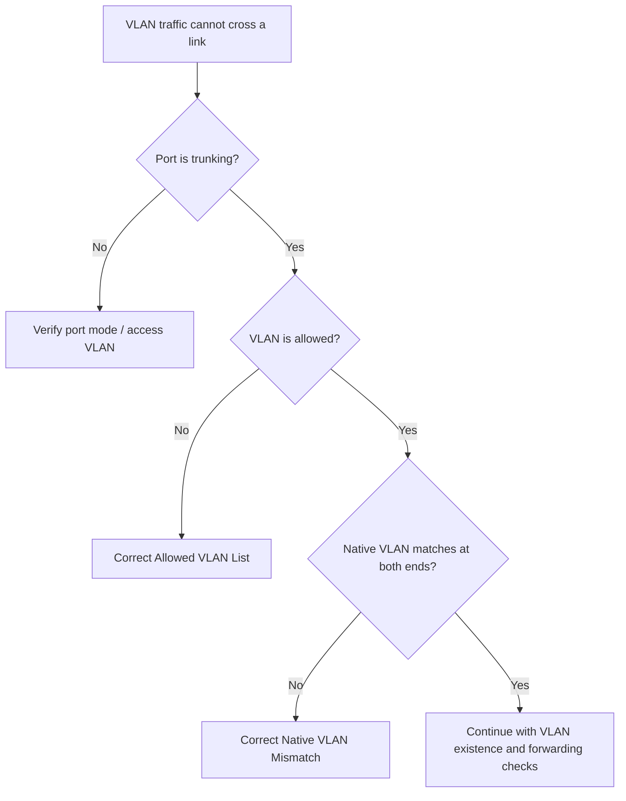

# Unit05：Subnetting 與 VLAN 知識地圖

tags: #map #acting-ccna #unit-map #subnetting #vlan #inter-vlan-routing

## Scope

- Unit：[[01_Units/Unit05-SubVLAN|Unit05-SubVLAN]]
- Source Note：[[02_Source_Notes/Unit05-SubVLAN|Unit05：Subnetting 與 VLAN]]
- Sources：
  - [[00_Source/Chapter 11 - IPv4 網路子網劃分|Chapter 11 - IPv4 網路子網劃分]]
  - [[00_Source/Chapter 12 - VLAN|Chapter 12 - VLAN]]

## Core Map

## Subnetting Relationships

- [[IPv4 Address]] → divided by → [[Prefix Length]] / [[Netmask]]
- [[Network Portion and Host Portion]] → extended through → [[Borrowed Bits]]
- [[Borrowed Bits]] → creates → [[Subnetting]]
- Borrowing more bits → increases subnet count but decreases host capacity per subnet
- [[FLSM]] → creates equal-size subnets
- [[VLSM]] → creates variable-size subnets according to host requirements
- [[Subnet Five Attributes]] → calculated for each subnet
- [[Point-to-Point Subnet]] → often uses /30 or /31 to conserve address space
- [[Magic Number Method]] → helps locate subnet boundaries quickly

## VLAN Relationships

- [[Layer 3 Segmentation]] → uses → [[Subnetting]]
- Layer 3-only segmentation on shared switches → still leaves one → [[Broadcast Domain]]
- [[VLAN]] → provides → [[Layer 2 Segmentation]]
- [[VLAN]] → divides one physical switch into multiple virtual switches / broadcast domains
- [[Access Port]] → belongs to one → [[VLAN]]
- [[Default VLAN]] → contains switch ports before explicit VLAN assignment
- [[VLAN ID]] → identifies VLAN membership
- [[Trunk Port]] → carries multiple → [[VLAN]]s over one link
- [[IEEE 802.1Q Tag]] → preserves VLAN identity on → [[Trunk Port]]
- [[Allowed VLAN List]] → limits which VLANs traverse a trunk
- [[Native VLAN]] → carries untagged traffic on an 802.1Q trunk
- Native VLAN inconsistency → causes → [[Native VLAN Mismatch]]
- Untagged frame ingress on an [[Access Port]] → assigned to → configured access [[VLAN]] (or [[Default VLAN]] before explicit assignment)
- Untagged frame ingress on a [[Trunk Port]] → assigned to → [[Native VLAN]]
- `switchport trunk allowed vlan <list>` without `add` → replaces → current [[Allowed VLAN List]]
- Missing VLAN from [[Allowed VLAN List]] → prevents that VLAN's traffic from crossing → [[Trunk Port]]

## VLAN Trunk Troubleshooting Flow

- Workflow note：[[12-VLAN Question|VLAN Trunking Troubleshooting]]

## Inter-VLAN Routing Relationships

- [[VLAN]] segmentation → prevents direct Layer 2 communication between VLANs
- Communication between VLANs → requires → [[Inter-VLAN Routing]]
- [[Inter-VLAN Routing]] → reuses → [[Default Gateway]] and [[Routing Table]]
- Separate router physical interfaces → simple inter-VLAN routing but consumes interfaces
- [[12.4-Router on a Stick]] → reduces physical interfaces by using → [[Trunk Port]] + [[Subinterface]]
- [[Subinterface]] → mapped to VLAN by → [[IEEE 802.1Q Tag]] / `encapsulation dot1q`
- [[12.4-Multilayer Switch]] → performs switching and routing in one device
- [[Switch Virtual Interface]] → acts as VLAN default gateway on a → [[12.4-Multilayer Switch]]
- [[Routed Port]] → lets a multilayer switch connect to external Layer 3 networks

## Cross-document / Cross-unit Relationships Added

### Chapter 11 → Chapter 12

- [[Subnetting]] supplies the Layer 3 network boundaries that [[VLAN]] design should mirror at Layer 2.
- [[VLSM]] can allocate right-sized subnets to departments or sites; Chapter 12 then maps those departments/subnets into VLANs.
- [[Subnet Five Attributes]] provides the default-gateway address candidates used when configuring router interfaces, ROAS subinterfaces, or SVIs.

### Unit03 → Unit05

- [[IPv4 Address]], [[Prefix Length]], [[Netmask]], [[IPv4 Network Address]], [[IPv4 Broadcast Address]], and [[Usable IPv4 Address Range]] become prerequisites for [[Subnetting]].
- [[Broadcast Domain]] becomes configurable through [[VLAN]] rather than merely descriptive of switch/LAN behavior.
- [[Ethernet Frame]] is extended by [[IEEE 802.1Q Tag]] when crossing trunk links.

### Unit04 → Unit05

- [[Default Gateway]], [[Routing Table]], [[Connected Route]], and [[Local Route]] are reused by [[Inter-VLAN Routing]], especially with [[Subinterface]] and [[Switch Virtual Interface]].
- [[Network Interface]] splits into multiple more specific roles: [[Access Port]], [[Trunk Port]], [[Subinterface]], [[Switch Virtual Interface]], and [[Routed Port]].
- [[Packet Life Cycle]] applies inside VLAN designs: host-to-default-gateway forwarding still occurs, but the Layer 2 frame is constrained by VLAN membership.

### Unit05 → Later Units

- [[VLAN]], [[Trunk Port]], [[IEEE 802.1Q Tag]], and [[Native VLAN]] lead into DTP/VTP, STP per VLAN, EtherChannel trunking, and VLAN security.
- [[VLSM]] leads into route summarization, OSPF network design, and ACL wildcard/matching logic.
- [[12.4-Multilayer Switch]], [[Switch Virtual Interface]], and [[Routed Port]] lead into campus design and Layer 3 switching troubleshooting.

## REVIEW

- 集中 REVIEW 紀錄：[[06_review/Unit05-SubVLAN REVIEW|Unit05-SubVLAN REVIEW]]
