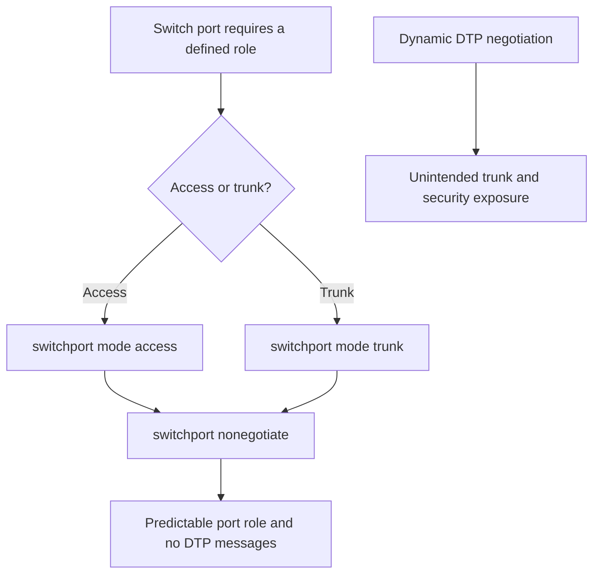
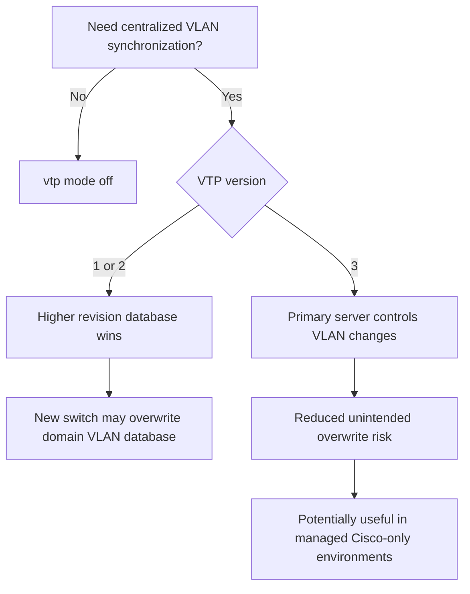

# Unit06：DTP／VTP Operational Decision Map

tags: #map #acting-ccna #dtp #vtp #vlan #operations

## Scope

- Source Note：[[02_Source_Notes/Unit06-DTPVTPSTPRSTP|Unit06：DTP、VTP、STP 與 RSTP]]
- Concepts：[[13-Dynamic Trunking Protocol]]、[[13-VLAN Trunking Protocol]]
- Source：[[00_Source/Chapter 13 - DTP 與 VTP]]
- Parent Unit Map：[[Unit06-DTPVTP-STP-RSTP Knowledge Map|Unit06 Knowledge Map]]

## DTP Decision

### Durable Relationships

- [[13-Dynamic Trunking Protocol]] → negotiates → [[Trunk Port]] operational mode
- Explicit access/trunk configuration → reduces need for → [[13-Dynamic Trunking Protocol]]
- DTP negotiation with an untrusted device → may create → unintended trunk access
- `switchport nonegotiate` → prevents → DTP message transmission
- Cisco-only operation → limits → DTP multi-vendor usefulness

## VTP Decision

### Durable Relationships

- [[13-VLAN Trunking Protocol]] → synchronizes → [[VLAN]] database across a VTP domain
- [[Trunk Port]] → carries → VTP messages
- Higher revision number → is treated as → newer VLAN database information
- VTP versions 1/2 + newly connected high-revision switch → may cause → domain-wide VLAN database overwrite
- VTP version 3 primary server → reduces → unintended database overwrite risk
- No centralized synchronization requirement → leads to → `vtp mode off`

## Practical Contrast

| Protocol | Intended convenience | Main operational concern | Source-supported direction |
| :------- | :------------------- | :----------------------- | :------------------------- |
| DTP | Automatically negotiate access/trunk operational mode | Unintended trunk, security exposure, Cisco-only behavior | Explicitly configure port mode and disable negotiation |
| VTP v1/v2 | Synchronize VLAN databases | Higher-revision database can overwrite the domain | Avoid unnecessary participation; control revision state |
| VTP v3 | Centralize VLAN changes through a primary server | Still requires deliberate domain and change management | Can be useful where centralized Cisco VLAN automation is required |

## Confidence

- DTP disablement and VTP revision behavior：Explicit in Chapter 13.
- VTPv3 as a conditional operational choice：Strongly inferred from Chapter 13's primary-server discussion and positive concluding assessment; not a universal deployment recommendation.
