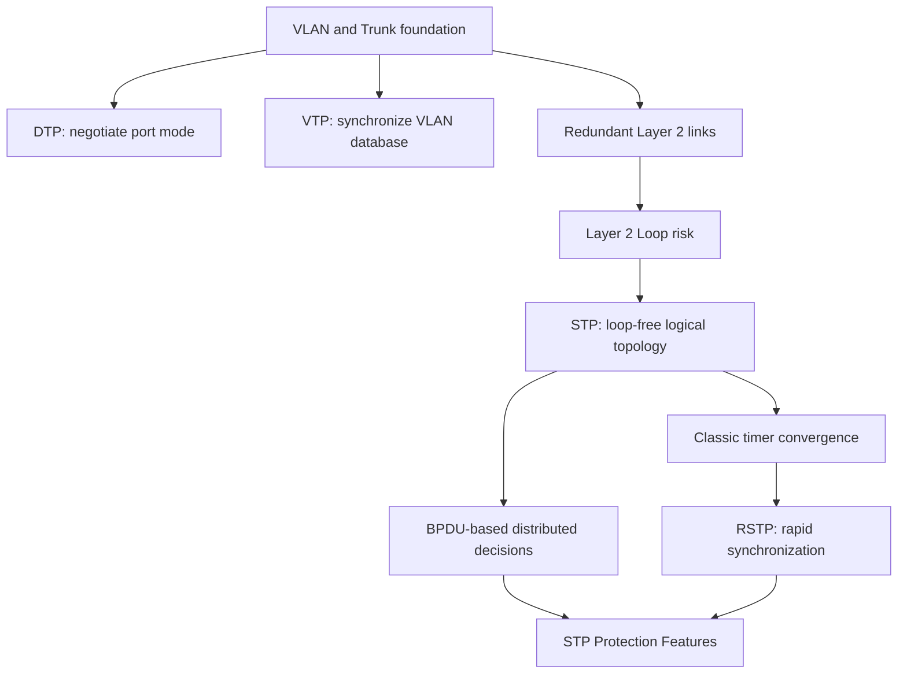
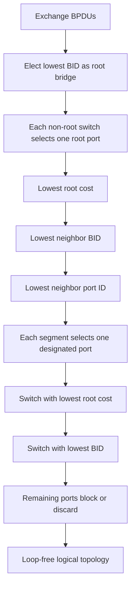
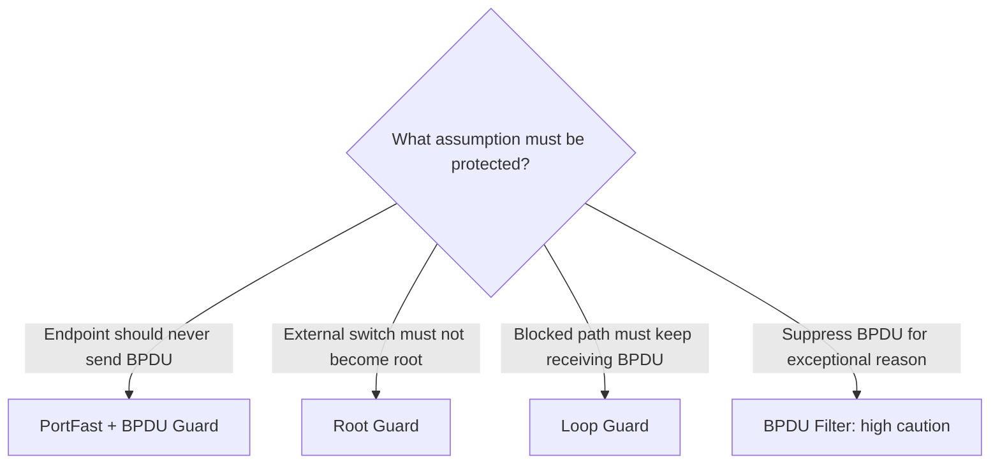

# Unit06：DTP、VTP、STP、RSTP Knowledge Map

tags: #map #acting-ccna #vlan #dtp #vtp #stp #rstp

## Scope

- Unit：[[01_Units/Unit06-DTPVTPSTPRSTP|Unit06：DTP、VTP、STP 與 RSTP]]
- Source Note：[[02_Source_Notes/Unit06-DTPVTPSTPRSTP|Unit06：DTP、VTP、STP 與 RSTP]]
- Sources：Chapter 13、14、15

## Cross-Chapter Knowledge Chain



## Problem → Mechanism → Limitation → Evolution

| Problem | Mechanism | Limitation／risk | Leads to |
|---|---|---|---|
| Manual trunk mode consistency | [[13-Dynamic Trunking Protocol|DTP]] | Cisco-only、unintended trunk | Explicit port mode + `nonegotiate` |
| Manual VLAN database consistency | [[13-VLAN Trunking Protocol|VTP]] | v1/v2 revision overwrite、large blast radius | VTPv3 primary server or manual control |
| Redundant links create cycles | [[Spanning Tree Protocol]] | Blocks capacity；classic convergence slow | [[Rapid Spanning Tree Protocol]] |
| Topology assumptions may be violated | [[STP Protection Features]] | Wrong feature placement can cause outage | Deliberate trust-boundary design |

## STP Decision Tree



## Port Role, State, and Link Type

| Dimension | Answers | Examples |
|---|---|---|
| Role | Port 在 topology 中負責什麼？ | Root、Designated、Alternate、Backup |
| State | Port 現在能做什麼？ | Discarding／Blocking、Learning、Forwarding |
| RSTP link type | 能否與鄰居 rapid sync？ | Point-to-point、Shared、Edge |

## Convergence Timeline

```text
Classic STP indirect BPDU loss
Max Age 20s + Listening 15s + Learning 15s → up to 50s

RSTP indirect BPDU loss
3 missed BPDUs × Hello 2s + sync → just over 6s in source example

RSTP physical port-down
Immediate detection + sync → potentially under 1s in source example
```

## Protection Decision Map



## Durable Relationships

- [[VLAN]] and [[Trunk Port]] **are prerequisites for** per-VLAN STP operation and Chapter 13 automation.
- [[13-Dynamic Trunking Protocol]] **negotiates** trunk operational mode but **does not create** VLANs.
- [[13-VLAN Trunking Protocol]] **synchronizes** VLAN database but **does not select** forwarding paths.
- Layer 2 redundancy + [[Frame Flooding]] + absence of frame TTL **can cause** [[Layer 2 Loop]].
- [[Layer 2 Loop]] **causes** broadcast storm and [[MAC Address Learning|MAC address flapping]].
- [[Spanning Tree Protocol]] **prevents** Layer 2 loops by blocking redundant logical paths.
- [[Spanning Tree Protocol]] **depends on** [[Bridge Protocol Data Unit]] exchange.
- Lowest Bridge ID **determines** root bridge; accumulated path cost **influences** root/designated port selection.
- [[Rapid Spanning Tree Protocol]] **reuses** STP topology selection but **replaces timer dependence with** synchronization where possible.
- Point-to-point full-duplex links **enable** RSTP rapid sync; shared or incompatible links **fall back to** timer behavior.
- [[STP Protection Features]] **enforce** assumptions about edge ports, root placement, and BPDU continuity.
- DTP/VTP automation and STP/RSTP topology control **solve different control-plane problems** and must be verified separately.

## Troubleshooting Flow

```text
Layer 2 reachability or instability
  ↓
1. VLAN exists and port access/trunk state correct?
  ↓
2. Expected root bridge and STP instance correct?
  ↓
3. Port role/state/type matches design?
  ↓
4. Root cost and BID tiebreakers explain path?
  ↓
5. Port inconsistent or err-disabled?
  ↓
6. BPDU received, missing, filtered, or superior?
  ↓
7. Correct root cause before recovering port
```

## Cross-Unit Relationships

- [[Ethernet Switching]] and [[Frame Flooding]] explain why redundant paths can loop.
- [[MAC Address Learning]] explains MAC flapping during a loop.
- [[VLAN]] makes PVST+／Rapid PVST+ per-VLAN instances meaningful.
- [[Trunk Port]] carries multiple VLANs whose STP states may differ by instance.
- Future EtherChannel consolidates parallel physical links into one logical STP link.

## REVIEW

- [[06_review/Unit06-DTPVTPSTPRSTP REVIEW|Unit06 REVIEW]]
