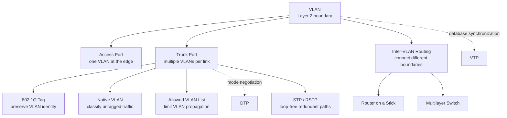
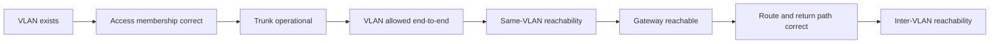

# VLAN Knowledge Map

tags: #map #acting-ccna #vlan #trunk #inter-vlan-routing #dtp #vtp

## Scope

這份跨 Unit Map 整合 Chapter 12 的 VLAN data plane、Chapter 13 的 DTP/VTP automation，以及 Chapter 14–15 對 redundant VLAN paths 的 loop prevention。

- Core concepts：[[VLAN]]、[[Trunk Port]]、[[Inter-VLAN Routing]]、[[13-Dynamic Trunking Protocol]]、[[13-VLAN Trunking Protocol]]、[[Spanning Tree Protocol]]、[[Rapid Spanning Tree Protocol]]
- Unit05：[[02_Source_Notes/Unit05-SubVLAN|Subnetting 與 VLAN]]
- Unit06：[[02_Source_Notes/Unit06-DTPVTPSTPRSTP|DTP、VTP、STP 與 RSTP]]

## Knowledge Structure



## Four Distinct Problems

| Problem | Core concept | Result |
|---|---|---|
| 限制 Layer 2 broadcast/flooding 範圍 | [[VLAN]] | 形成獨立 broadcast domains |
| 讓相同 VLAN 跨越一條 shared link | [[Trunk Port]] | 以 802.1Q 保存 VLAN identity |
| 讓不同 VLAN/subnets 受控互通 | [[Inter-VLAN Routing]] | Gateway 執行 Layer 3 forwarding |
| 自動化 Cisco switch control state | [[13-Dynamic Trunking Protocol]]／[[13-VLAN Trunking Protocol]] | 協商 trunk mode／同步 VLAN database |

## Data Plane vs Control Mechanisms

```text
Data plane
VLAN membership → access/trunk forwarding → optional Layer 3 routing

Control / automation
DTP → port operational mode
VTP → VLAN database state
```

- 沒有 DTP，仍可手動設定 access/trunk port。
- 沒有 VTP，仍可在各 switch 手動建立 VLAN。
- 沒有 trunk，VTP messages 無法跨該 access link 傳播，多 VLAN traffic 也不能共享該 link。
- Trunk 本身只攜帶 VLAN traffic；它不會替不同 VLAN 執行 routing。

## End-to-End Dependency Chain



## Troubleshooting Routes

- VLAN/trunk path：[[04_Maps/VLAN Trunking Troubleshooting|VLAN Trunking Troubleshooting]]
- Inter-VLAN common flow：[[04_Maps/Inter-VLAN Routing Packet Flow|Inter-VLAN Routing Packet Flow]]
- ROAS detail：[[04_Maps/12.4-Router-on-a-Stick-Packet-Flow|Router on a Stick Packet Flow]]
- Multilayer detail：[[04_Maps/12.4-Multilayer-Switching-Packet-Flow|Multilayer Switching Packet Flow]]
- DTP/VTP operational choice：[[04_Maps/Unit06-DTPVTP Operational Decision Map|DTP/VTP Operational Decision Map]]
- DTP/VTP/STP/RSTP cross-chapter chain：[[04_Maps/Unit06-DTPVTP-STP-RSTP Knowledge Map|Unit06 Knowledge Map]]

## Durable Relationships

- [[Access Port]] → assigns untagged ingress traffic to → one [[VLAN]]
- [[Trunk Port]] → transports → multiple VLANs over one physical link
- [[IEEE 802.1Q Tag]] → preserves → VLAN identity across a trunk
- [[Native VLAN]] → classifies → untagged trunk traffic
- [[Allowed VLAN List]] → constrains → VLAN propagation per trunk
- [[VLAN]] isolation → requires → [[Inter-VLAN Routing]] for cross-VLAN communication
- [[12.4-Router on a Stick]] → implements inter-VLAN routing with → trunk + subinterfaces
- [[12.4-Multilayer Switch]] → implements inter-VLAN routing with → SVIs + internal routing
- [[13-Dynamic Trunking Protocol]] → negotiates → trunk operational mode
- [[13-VLAN Trunking Protocol]] → synchronizes → VLAN database
- DTP/VTP availability → does not replace → explicit VLAN, trunk, gateway, and routing verification
- [[Spanning Tree Protocol]] → prevents → [[Layer 2 Loop]] across redundant VLAN paths
- [[Rapid Spanning Tree Protocol]] → preserves STP path selection while improving → convergence

## Common Confusions

- VLAN ID 一樣不保證 end-to-end connectivity；沿途 VLAN existence、trunk state 與 allowed list 都要正確。
- DTP 的「Trunking」是協商 port mode；VTP 的「Trunking」名稱則容易誤導，它同步的是 VLAN database。
- Native VLAN 決定 untagged trunk traffic 的歸屬；Default VLAN 是 access ports 的初始 VLAN，兩者不是同一角色。
- Trunk extends a VLAN；router connects VLANs。

## Questions

- [[05_Questions/Unit05-SubVLAN Questions|Unit05 VLAN 與 Inter-VLAN Routing Questions]]
- [[05_Questions/Unit06-DTPVTPSTPRSTP Questions|Unit06 DTP/VTP/STP/RSTP Questions]]
