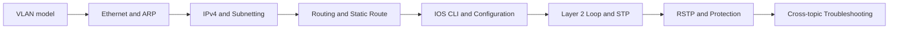

# 2026-09-06 Daily Work Review Map

tags: #daily-review #review-map #acting-ccna

## Review Scope

- Work record：[[80_DailyWorkRecord/2026-09-06|2026-09-06 Daily Work Record]]
- Total full path：8 units × 15 minutes = 120 minutes
- Priority path：Units 1、2、6、8 = 60 minutes

## Review Map



## Unit 1 — VLAN knowledge structure（15 minutes）

**Goal**

能從 Layer 2 boundary 解釋 Access、Trunk、802.1Q、Native VLAN、Allowed VLAN List 與 Inter-VLAN Routing 的角色。

**Read — 7 minutes**

- Source：[[00_Source/Chapter 12 - VLAN]] 的概念導言與 trunk／inter-VLAN sections
- Concept：[[VLAN]]、[[Trunk Port]]、[[Inter-VLAN Routing]]
- Map：[[04_Maps/VLAN Knowledge Map]]

**Recall — 4 minutes**

關閉筆記，畫出：

```text
VLAN
├── same-VLAN extension
└── cross-VLAN communication
```

把 Access Port、Trunk、802.1Q 與 routing 放到正確分支。

![[Pasted image 20260907205509.png]]

**Verify — 3 minutes**

- Native VLAN 與 Default VLAN 為什麼不是同一概念？
- VLAN ID 相同，為什麼仍不保證 end-to-end connectivity？

**Output — 1 minute**

用一句話分別定義「VLAN extends／Trunk transports／Router connects」。

## Unit 2 — Ethernet switching and ARP（15 minutes）⭐

**Goal**

能逐 frame 說明 switch learning、forwarding／flooding 與 ARP 的相互依賴。

**Read — 7 minutes**

- Source：[[00_Source/Chapter 6 - Ethernet LAN 交換]] 的 MAC table 與 ARP examples
- Concepts：[[Ethernet Switching]]、[[MAC Address Learning]]、[[Frame Forwarding]]、[[Address Resolution Protocol]]
- Map：[[04_Maps/Ethernet Switching 與 ARP 地圖]]

**Recall — 4 minutes**

從空 MAC table、空 ARP cache 開始，口述同 subnet 兩台 hosts 第一次 ping 的 frame sequence。

假設：

- Host A：`192.168.1.10/24`，MAC = `AA:AA:AA:AA:AA:AA`
    
- Host B：`192.168.1.20/24`，MAC = `BB:BB:BB:BB:BB:BB`
    
- 兩台接在同一台 Layer 2 Switch
    
- 一開始：
    
    - A、B 的 ARP cache 都是空的
        
    - Switch MAC address table 也是空的
        
- A 第一次執行：
    

```text
ping 192.168.1.20
```

整個過程要分成 **ARP 階段** 與 **ICMP 階段** 來看。

### 1. A 先判斷 B 是否在同 subnet

A 用自己的 `/24` mask 計算：

```text
A: 192.168.1.10/24
B: 192.168.1.20/24

Network = 192.168.1.0/24
```

所以 A 知道：

> B 跟我在同一個 subnet，不需要送給 Default Gateway，可以直接送給 B。

但是 A 此時只有 B 的 IP：

```text
192.168.1.20
```

卻不知道 B 的 MAC。

因此現在 **還不能送 ICMP Echo Request**，必須先 ARP。

---

## 2. Frame #1：ARP Request

A 發出 Ethernet broadcast：

```text
Ethernet
Src MAC = AA:AA:AA:AA:AA:AA
Dst MAC = FF:FF:FF:FF:FF:FF
Type    = ARP

ARP
Who has 192.168.1.20?
Tell 192.168.1.10
```

可以口述成：

> A 想 ping B，但不知道 B 的 MAC，因此送出 ARP Request。ARP Request 使用 Ethernet broadcast，目的 MAC 是 FF:FF:FF:FF:FF:FF。

Switch 收到這個 frame 時，第一件事不是看 destination，而是先學 **source MAC**：

```text
MAC Table

AA:AA:AA:AA:AA:AA → Port 1
```

接著 Switch 發現 destination 是 broadcast，所以：

```text
Flood 到除了 ingress port 之外的所有 ports
```

因此 B 收到 ARP Request。

---

## 3. Frame #2：ARP Reply

B 查看 ARP Request：

```text
Who has 192.168.1.20?
```

發現：

> 192.168.1.20 就是我。

因此 B 回覆 A：

```text
Ethernet
Src MAC = BB:BB:BB:BB:BB:BB
Dst MAC = AA:AA:AA:AA:AA:AA
Type    = ARP

ARP Reply
192.168.1.20 is at BB:BB:BB:BB:BB:BB
```

注意：

> **ARP Reply 通常是 unicast，不是 broadcast。**

Switch 收到 B 的 frame，又從 source MAC 學到：

```text
BB:BB:BB:BB:BB:BB → Port 2
```

所以此時 MAC table 已經變成：

```text
MAC Address              Port
--------------------------------
AA:AA:AA:AA:AA:AA       Port 1
BB:BB:BB:BB:BB:BB       Port 2
```

因為 Switch 已經知道 A 在 Port 1，所以 ARP Reply 直接 unicast 給 A。

A 收到後，把資料寫入 ARP cache：

```text
192.168.1.20 → BB:BB:BB:BB:BB:BB
```

---

# 4. Frame #3：ICMP Echo Request

現在 A 終於知道：

```text
IP 192.168.1.20
        ↓ ARP
MAC BB:BB:BB:BB:BB:BB
```

所以才真正送 ping：

```text
Ethernet
Src MAC = AA:AA:AA:AA:AA:AA
Dst MAC = BB:BB:BB:BB:BB:BB

IPv4
Src IP  = 192.168.1.10
Dst IP  = 192.168.1.20

ICMP
Echo Request
```

Switch 查 MAC table：

```text
BB:BB:BB:BB:BB:BB → Port 2
```

因此直接 unicast 到 B。

---

# 5. Frame #4：ICMP Echo Reply

B 收到 Echo Request 後回覆：

```text
Ethernet
Src MAC = BB:BB:BB:BB:BB:BB
Dst MAC = AA:AA:AA:AA:AA:AA

IPv4
Src IP  = 192.168.1.20
Dst IP  = 192.168.1.10

ICMP
Echo Reply
```

Switch 查：

```text
AA:AA:AA:AA:AA:AA → Port 1
```

所以直接送回 A。

A 收到後：

```text
Reply from 192.168.1.20 ...
```

第一次 ping 完成。

---

## 把整個 sequence 壓縮成 CCNA 最重要的圖

```text
Host A                 Switch                 Host B
192.168.1.10                                  192.168.1.20
MAC AA                                        MAC BB

ARP cache = empty       MAC table = empty     ARP cache = empty
   |                        |                      |
   |--- ARP Request ------->|                      |
   |    Src MAC = AA        |                      |
   |    Dst MAC = FF:FF...  |                      |
   |                        | learn AA → Port 1    |
   |                        |--- flood ----------->|
   |                        |                      |
   |                        |<--- ARP Reply --------|
   |                        |    Src MAC = BB      |
   |                        |    Dst MAC = AA      |
   |                        | learn BB → Port 2    |
   |<--- ARP Reply ---------|                      |
   |                        |                      |
   | ARP cache:             |                      |
   | 192.168.1.20 → BB      |                      |
   |                        |                      |
   |--- ICMP Echo Request ->|--------------------->|
   |    Src MAC = AA        |     unicast          |
   |    Dst MAC = BB        |                      |
   |    Src IP  = .10       |                      |
   |    Dst IP  = .20       |                      |
   |                        |                      |
   |<-- ICMP Echo Reply ----|<---------------------|
   |    Src MAC = BB        |     unicast          |
   |    Dst MAC = AA        |                      |
   |                        |                      |
 ping success
```

最適合 CCNA 口試式記憶的是這一句：

> **同 subnet 第一次 ping：先用 ARP broadcast 找到目的主機的 MAC；Switch 同時從 source MAC 學習 MAC table；得到 MAC 後，再用 unicast 傳送 ICMP Echo Request / Echo Reply。**

還有一個非常容易考的細節：**Switch 學 MAC 是看 Source MAC，不是 Destination MAC；Host 的 ARP table 則是 IP → MAC 的對照。**


**Verify — 3 minutes**

- === Switch 為什麼從 source MAC 學習，卻用 destination MAC 做 forwarding decision？ ===

CCNA 可以直接記一句：

> **Switch learns where a device is from the source MAC, and decides where a frame goes from the destination MAC.**

更精確地說，Switch 的核心邏輯就是：

```
Frame enters port X
       |
       v
Read Source MAC
       |
       +----> Update MAC table:
       |      Source MAC → Port X
       |
       v
Read Destination MAC
       |
       v
Look up MAC table
       |
   +---+------------------+
   |                      |
Known                  Unknown
   |                      |
Forward                Flood
to matching port
```

其中最值得理解的是：**Source MAC 是 Switch「已經看到的事實」；Destination MAC 是 Switch「接下來要解決的方向」。**

-  === ARP table 正確時，switch 為什麼仍可能 flood 第一個 frame？ ===

最重要的區分是：

|Table|誰使用|用途|
|---|---|---|
|ARP table|Host / Router|`IP → MAC`|
|MAC address table|Switch|`MAC → Port`|

因此：

> **ARP table 正確 ≠ Switch 知道 destination MAC 在哪個 port。**

這也是 CCNA 很重要的一個陷阱題。

你可以把它記成：

```
ARP answers:
「我要送給哪個 MAC？」

MAC table answers:
「這個 MAC 在哪個 port？」
```

所以即使 Host 已經知道「我要送給 BB」，Switch 仍可能不知道「BB 在 Port 2」，因此第一個 frame 還是可能被 flood。


**Output — 1 minute**

=== 寫出「Host ARP table」與「Switch MAC table」各自回答的問題。 ===

可以直接這樣記：

- **Host ARP table 回答：**  
    「這個 **IP address 對應哪一個 MAC address？**」
- **Switch MAC table 回答：**  
    「這個 **MAC address 位於哪一個 switch port？**」

ARP table：IP → MAC
MAC table：MAC → Port

## Unit 3 — IPv4 Addressing and Subnetting（15 minutes）

**Goal**

能從 address + prefix 推導 subnet identity、broadcast 與 usable range，而不是只背公式。

**Read — 7 minutes**

- Sources：[[00_Source/Chapter 7 - IPv4 位址]]、[[00_Source/Chapter 11 - IPv4 網路子網劃分]]
- Concepts：[[IPv4 Addressing]]、[[IPv4 Address]]、[[Subnetting]]
- Map：[[04_Maps/IPv4 Addressing 基礎地圖]]

**Recall — 4 minutes**

任選一個 `/26` address，手算 network、broadcast、usable range 與 host count。

**Verify — 3 minutes**

- Prefix 沒有 address，或 address 沒有 prefix，分別缺少什麼資訊？
- Borrowed bits 如何同時增加 subnets 並減少每 subnet hosts？

**Output — 1 minute**

寫出一個 subnet 的五項 attributes。

## Unit 4 — Routing Table and Static Route（15 minutes）

**Goal**

能區分 route installation、route selection 與 packet forwarding。

**Read — 7 minutes**

- Sources：[[00_Source/Chapter 9 - 路由基礎]]、[[00_Source/Chapter 10 - 封包的一生]]
- Concepts：[[Routing Table]]、[[Route Selection]]、[[Static Route]]
- Map：[[04_Maps/Unit04-RouterSwitch-Packet 知識地圖]]

**Recall — 4 minutes**

畫出 destination IP → longest-prefix match → next hop／exit interface → ARP／encapsulation 的順序。

**Verify — 3 minutes**

- Default route 為什麼只在沒有更 specific route 時使用？
- Recursive static route 與 fully specified static route 的 resolution path 有何不同？

**Output — 1 minute**

列出 routing table decision 與 Ethernet forwarding decision 各使用哪個 destination field。

## Unit 5 — Cisco IOS CLI and Configuration（15 minutes）

**Goal**

能區分 mode、running state、operational state 與 startup persistence。

**Read — 7 minutes**

- Source：[[00_Source/Chapter 5 - Cisco IOS CLI]]
- Concepts：[[Cisco IOS CLI]]、[[Cisco IOS Command Mode]]、[[IOS Configuration File]]
- Map：[[04_Maps/Cisco IOS CLI 與 Configuration 地圖]]

**Recall — 4 minutes**

不看筆記畫出 User EXEC → Privileged EXEC → Global Configuration → submode，以及返回路徑。

**Verify — 3 minutes**

- Command accepted、configuration applied、operation correct、configuration saved 為什麼是四件事？
- Reload 後設定消失時，running 與 startup 各提供什麼 evidence？

**Output — 1 minute**

寫出 configure → verify → save 的最小命令流程。

## Unit 6 — Layer 2 Loop and STP algorithm（15 minutes）⭐

**Goal**

能從 failure model 推導 STP 三步 algorithm，而不是只背 port roles。

**Read — 7 minutes**

- Sources：[[00_Source/Chapter 14.1 - The need for STP]]、[[00_Source/Chapter 14.3 - The STP algorithm]]
- Concepts：[[Layer 2 Loop]]、[[Bridge Protocol Data Unit]]、[[Spanning Tree Protocol]]
- Map：[[04_Maps/Unit06-DTPVTP-STP-RSTP Knowledge Map]] 的 STP Decision Tree

**Recall — 4 minutes**

寫出：root bridge election → root port selection → designated port selection 的比較順序。

**Verify — 3 minutes**

- Root port 為何是每台 non-root switch 一個，designated port 卻是每個 segment 一個？
- 為什麼比較 neighbor port ID，而不是候選 local port ID？何時才加入 local port ID？

**Output — 1 minute**

用一條 cause-effect chain 連接 redundancy、BUM flooding、broadcast storm 與 MAC flapping。

## Unit 7 — RSTP convergence and protection（15 minutes）

**Goal**

能說明 RSTP 快在哪裡，以及每項 protection feature 保護哪個假設。

**Read — 7 minutes**

- Sources：[[00_Source/Chapter 15.2 - STP and RSTP comparison]]、[[00_Source/Chapter 15.3 - RSTP link types]]、[[00_Source/Chapter 15.4 - Root Guard, Loop Guard, and BPDU Filter]]
- Concepts：[[Rapid Spanning Tree Protocol]]、[[STP Protection Features]]
- Map：[[04_Maps/Unit06-DTPVTP-STP-RSTP Knowledge Map]] 的 convergence timeline 與 protection decision map

**Recall — 4 minutes**

重建兩個表：STP states ↔ RSTP states；PortFast／BPDU Guard／Root Guard／Loop Guard／BPDU Filter ↔ trigger。

**Verify — 3 minutes**

- RSTP algorithm 與 STP 相同，為何 convergence 仍較快？
- Root Guard 與 Loop Guard 分別對「收到」和「沒收到」哪類 BPDU 做反應？

**Output — 1 minute**

用一句話解釋為何 interface-level BPDU Filter 是高風險設定。

## Unit 8 — Cross-topic troubleshooting（15 minutes）⭐

**Goal**

能用 evidence 分辨 VLAN、trunk、STP、routing 與 configuration persistence 問題。

**Read — 5 minutes**

- [[04_Maps/VLAN Trunking Troubleshooting]]
- [[04_Maps/Unit06-DTPVTP-STP-RSTP Knowledge Map|Unit06 Knowledge Map]]
- [[04_Maps/Cisco IOS CLI 與 Configuration 地圖]]

**Scenario — 5 minutes**

某 VLAN 在 redundant switched LAN 中突然不通。依序判斷：

1. VLAN 是否存在？
2. Access／trunk／allowed list 是否正確？
3. Root 與 port role/state 是否符合設計？
4. Port 是否 root-inconsistent、loop-inconsistent 或 err-disabled？
5. Gateway／route／return path 是否存在？
6. 修正是否只在 running config、尚未保存？

**Verify — 4 minutes**

- VTP 刪除 VLAN 與 STP blocking link 在 show output 上有何不同？
- 一個 port forwarding 是否足以證明 end-to-end path 正確？

**Output — 1 minute**

寫下自己的固定排錯順序：physical → VLAN/trunk → STP → Layer 3 → persistence。

## Priority Path — 60 minutes

時間有限時依序完成：

1. Unit 1：建立 VLAN 主結構。
2. Unit 2：掌握 switching／ARP data path。
3. Unit 6：掌握 STP failure model 與 algorithm。
4. Unit 8：把 Concepts 轉成 troubleshooting workflow。

## Human Review Items

最後閱讀 [[06_review/Unit06-DTPVTPSTPRSTP REVIEW]]，特別確認：

- MSTP 是否暫時只留在 RSTP Versions。
- EtherChannel Unit 完成時，是否正式建立 logical-link 與 STP relationship。
- 實驗環境的 STP default mode 與 path-cost method 是否和來源範例相同。
- Protection features 的部署範圍是否有後續 campus-design source 支援。

## Completion Check

- [ ] 我能不看筆記畫出 VLAN → switching → routing 的分層關係。
- [ ] 我能依序完成 STP root／port role selection。
- [ ] 我能比較 STP 與 RSTP convergence。
- [ ] 我能針對 BPDU symptom 選擇正確 protection feature。
- [ ] 我能從 show evidence 判斷問題屬於 configuration、Layer 2 topology 或 Layer 3 forwarding。
